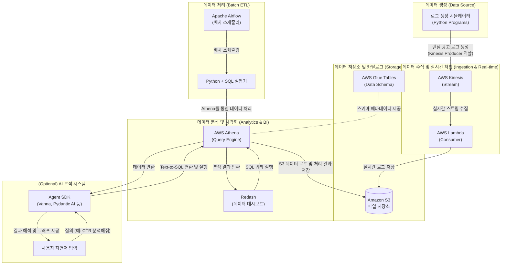

# 시스템 아키텍처 (System Architecture)

```mermaid
graph TD
    subgraph "데이터 생성 (Data Source)"
        A["로그 생성 시뮬레이터<br/>(Python Programs)"]
    end

    subgraph "데이터 수집 및 실시간 처리 (Ingestion & Real-time)"
        B["AWS Kinesis<br/>(Stream)"]
        C["AWS Lambda<br/>(Consumer)"]
    end

    subgraph "데이터 저장소 및 카탈로그 (Storage & Catalog)"
        D[("Amazon S3<br/>파일 저장소")]
        E["AWS Glue Tables<br/>(Data Schema)"]
    end

    subgraph "데이터 처리 (Batch ETL)"
        F["Apache Airflow<br/>(배치 스케줄러)"]
        G["Python + SQL 실행기"]
    end

    subgraph "데이터 분석 및 시각화 (Analytics & BI)"
        H["AWS Athena<br/>(Query Engine)"]
        I["Redash<br/>(데이터 대시보드)"]
    end

    subgraph "(Optional) AI 분석 시스템"
        J["Agent SDK<br/>(Vanna, Pydantic AI 등)"]
        K["사용자 자연어 입력"]
    end

    %% 연결 관계 정의
    A -- "랜덤 광고 로그 생성<br/>(Kinesis Producer 역할)" --> B
    B -- "실시간 스트림 수집" --> C
    C -- "실시간 로그 저장" --> D
    F -- "배치 스케줄링" --> G
    G -- "Athena를 통한 데이터 처리" --> H
    H -- "S3 데이터 로드 및 처리 결과 저장" --> D
    E -. "스키마 메타데이터 제공" .- H
    I -- "SQL 쿼리 실행" --> H
    H -- "분석 결과 반환" --> I
    K -- "질의 (예: CTR 분석해줘)" --> J
    J -- "Text-to-SQL 변환 및 실행" --> H
    H -- "데이터 반환" --> J
    J -- "결과 해석 및 그래프 제공" --> K
```
