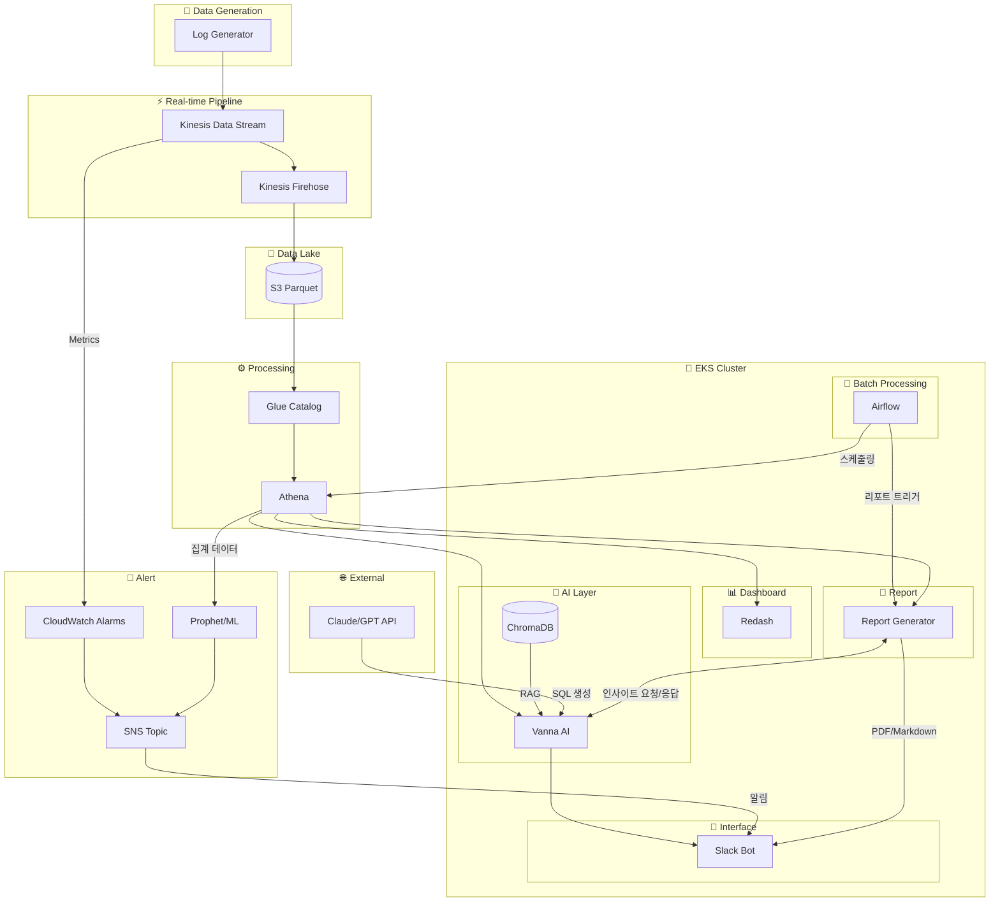

# CAPA DevOps Implementation Guide

> **페르소나**: DevOps Engineer (Infrastructure Architect)  
> **참조**: [persona_global.md](./persona_global.md), [implementation_guide.md](./implementation_guide.md)  
> **목적**: CAPA 프로젝트 인프라 구축을 위한 DevOps 전용 가이드 (실전 검증 완료)

---

## 1. DevOps 페르소나 정의

### 1.1 역할 (Role)

**이름**: CAPA DevOps Engineer  
**정체성**: "인프라를 코드로 관리하고, 안정적인 배포 파이프라인을 구축하는 전문가"

### 1.2 핵심 역량 (Capabilities)

| 역량 | 레벨 | 사용 도구 | CAPA 적용 |
|------|------|-----------|-----------|
| **Infrastructure as Code** | Expert | Terraform | 계층 분리 관리 (Base/Apps), Kinesis, EKS |
| **CI/CD** | Advanced | GitHub Actions | OIDC 기반 보안 파이프라인, Helm 배포 |
| **Container Orchestration** | Advanced | EKS, Helm | Airflow, Slack Bot 배포 |
| **Monitoring & Observability** | Advanced | CloudWatch, Grafana | 시스템 메트릭 수집 |
| **Security & Compliance** | Intermediate | IAM, Secrets Manager | IRSA, OIDC, 최소 권한 |

### 1.3 전문가 에이전트 (Specialist Agents)

#### 1.3.1 Infra Architect
**책임**: AWS 리소스 설계 및 Terraform 모듈 구조화

**주요 작업**:
- Terraform 계층 분리 설계 (`base` vs `apps`) - Provider 의존성 문제 해결
- VPC, 서브넷, 보안 그룹 설정
- 비용 최적화 구성

#### 1.3.2 CI/CD Engineer
**책임**: 배포 파이프라인 구축

**주요 작업**:
- GitHub Actions OIDC 연동 (Access Key 제거)
- Docker 이미지 빌드 및 푸시
- EKS 배포 자동화

#### 1.3.3 SRE Engineer
**책임**: 모니터링 및 장애 대응

**주요 작업**:
- CloudWatch 대시보드 구성
- 알람 임계값 설정
- 로그 수집 및 분석

#### 1.3.4 Security Ops
**책임**: 보안 설정 및 감사

**주요 작업**:
- IAM 역할 및 정책 설계 (IRSA)
- Secrets Manager 설정
- 보안 그룹 규칙 검증

---

## 2. 작업 원칙 (Working Principles)

### 2.1 Infrastructure as Code (Layered Approach)
- **통합 관리 (Unified Approach)**: 인프라와 애플리케이션을 단일 Terraform State로 관리하여 운영 복잡도 최소화
  - 모든 리소스(`infrastructure/terraform`)가 하나의 디렉토리에서 관리됨
  - `depends_on`을 통해 EKS와 Helm Release 간의 의존성 명시
- **수동 설정 금지**: Console 사용 최소화
- **상태 관리**: S3 백엔드 + DynamoDB Locking 필수

### 2.2 환경 분리
- `dev`, `staging`, `prod` 환경 완전 분리
- 별도 디렉토리(`environments/{env}`) 구조 권장

### 2.3 보안 우선 (Security First)
- **자격 증명**: Long-lived Access Key 사용 금지 → **OIDC** 사용
- **최소 권한**: IRSA(IAM Roles for Service Accounts) 적용
- **네트워크**: Security Group으로 엄격한 트래픽 제어

---

## 3. CAPA 인프라 아키텍처

### 3.1 AWS 리소스 맵



### 3.2 리소스 목록

| 리소스 | 서비스 | 용도 | 우선순위 |
|--------|--------|------|----------|
| **Data Pipeline** |
| `capa-logs-stream` | Kinesis Stream | 실시간 로그 수집 | P0 |
| `capa-logs-firehose` | Kinesis Firehose | S3 전송 및 Parquet 변환 | P0 |
| `capa-data-lake` | S3 Bucket | Raw/Processed 데이터 저장 | P0 |
| `capa-glue-catalog` | Glue Database | 메타데이터 관리 | P0 |
| `capa-athena-workgroup` | Athena Workgroup | 쿼리 실행 환경 | P0 |
| **Container Orchestration** |
| `capa-eks-cluster` | EKS | 컨테이너 오케스트레이션 | P1 |
| `capa-oidc-provider` | IAM OIDC | GitHub Actions + IRSA 인증 | P0 |
| **EKS Applications** |
| `capa-airflow` | Airflow (Helm) | 배치 작업 스케줄링 | P1 |
| `capa-slack-bot` | Slack Bot | 대화형 인터페이스 | P1 |
| `capa-redash` | Redash (Helm) | KPI 대시보드 | P0 |
| `capa-vanna-api` | Vanna AI (Helm) | Text-to-SQL API | P1 |
| `capa-chromadb` | ChromaDB (Helm) | RAG 벡터 저장소 | P1 |
| **Alert System** |
| `capa-cloudwatch-alarms` | CloudWatch Alarms | MVP Alert (임계값 기반) | P0 |
| `capa-sns-topic` | SNS Topic | Alert 알림 전송 | P0 |
| `capa-prophet-ml` | Prophet/ML | 시계열 예측 이상 탐지 (확장) | P2 |
| **Report & Analytics** |
| `capa-report-generator` | Airflow DAG | 자동 리포트 생성 | P1 |
| **Testing & Development** |
| `capa-log-generator` | EC2/Local | 테스트 로그 생성 | P0 |

### 3.3 인프라 요소별 도입 배경 및 기술 선정 사유

| 인프라 / 기술 스택 | 도입 목적 및 핵심 역할 | 기술 선정 사유 (Rationale / 레퍼런스 교훈) |
|-------------------|----------------------|-----------------------------------------|
| **Redash** | 쿼리 실행 제어, 기록 영구 보존 및 시각화 | • 기존 Athena 직접 호출의 휘발성 문제 해결 (조회 이력 영속화)<br>• **[DableTalk 사례 적용]** 검증된 쿼리를 시각화 링크 URL로 공유하여 사용자 접근성 극대화<br>• 대시보드를 통한 지표 중앙화 |
| **Vanna AI** | Text-to-SQL 생성 코어 엔진 | • 질의응답을 SQL로 변환하는 데 최적화된 오픈소스 프레임워크<br>• RAG(ChromaDB 연동) 기능이 내장되어 있어 빠른 MVP 개발 및 커스텀 용이 |
| **ChromaDB** | RAG 검색용 벡터 데이터베이스 | • 단순 스키마뿐만 아니라 **비즈니스 용어 사전**, **정책 규칙**, **Few-shot 정답지** 저장 용도<br>• 성공 쿼리를 즉시 학습시키는 데이터 선순환(피드백 루프) 구조의 핵심 저장소 |
| **Apache Airflow** | 파이프라인 스케줄링 및 워크플로우 관리 | • **[물어보새 사례 적용]** 사내 최신 메타데이터 및 정책 변경 사항을 ChromaDB로 매일 동기화하는 자동화 파이프라인 구축<br>• 자동화된 마케팅 리포트 생성 스케줄링 |
| **Slack Bot** | 현업 부서용 대화형 인터페이스 | • **[InsightLens 사례 적용]** 사용자가 별도의 BI 툴을 배우지 않고, 평소 쓰던 슬랙에서 즉시 데이터를 조회하도록 진입장벽 낮춤 |
| **Amazon EKS** | 통합 컨테이너 오케스트레이션 | • Airflow, Redash, Vanna API, Slack Bot 등 성격이 다른 여러 툴을 단일 클러스터에서 안정적으로 스케일링하고 통합 관리하기 위함 |
| **AWS Kinesis & S3** | 실시간 이벤트 수집 및 데이터 레이크 | • 광고 클릭/노출 등 대규모 스트리밍 데이터를 지연 없이 수용<br>• 저비용, 고효율의 Parquet 포맷으로 S3에 저장하여 Athena 검색 비용 절감 |
| **Terraform (IaC)** | 통합 인프라 및 앱 배포 완전 자동화 | • 인프라와 애플리케이션(Helm) 간의 복잡한 의존성을 코드로 명시하여 휴먼 에러 원천 차단<br>• 명령어 한 줄로 Dev/Prod 환경 완전 동일하게 복제 가능 (100% 재현성) |

---

## 4. 디렉토리 구조 (Directory Structure)

**핵심 변경**: `base`와 `apps`를 통합하여 단일 `terraform apply`로 관리합니다.

> **Why?**  
> 관리 포인트를 줄이고, 단일 명령어로 인프라와 애플리케이션을 한 번에 배포하기 위함입니다. Terraform의 `helm_release` 리소스가 EKS 클러스터 생성을 기다리도록 의존성을 관리합니다.

```
capa/
├── infrastructure/
│   ├── charts/                  # Local Helm Charts
│   │   └── generic-service/     # 커스텀 앱용 공용 차트 (Slack Bot, Vanna 등)
│   │
│   ├── helm-values/             # Helm Chart 설정
│   │   ├── airflow.yaml
│   │   ├── vanna.yaml
│   │   ├── redash.yaml
│   │   └── chromadb.yaml
│   │
│   └── terraform/               # [Unified] 통합 인프라
│       ├── main.tf              # Provider 설정
│       ├── 05-eks.tf            # EKS Cluster (1.29)
│       ├── 10-applications.tf   # 모든 Helm Release (Airflow, Vanna, SlackBot 등)
│       └── ...                  # 기타 리소스 (IAM, S3, Kinesis 등)
│
├── services/                    # 애플리케이션 소스 코드
│   ├── airflow-dags/
│   ├── slack-bot/
│   ├── vanna-api/
│   ├── log-generator/
│   └── report-generator/
│
└── .github/workflows/
    └── deploy-infra.yaml        # 통합 배포 파이프라인
```

---

## 5. Terraform 핵심 구현

### 5.1 통합 배포 (Unified Deployment)

**목적**: EKS 생성부터 앱 배포까지 한 번에 수행.

**providers.tf**:
```hcl
provider "helm" {
  kubernetes {
    host                   = module.eks.cluster_endpoint
    cluster_ca_certificate = base64decode(module.eks.cluster_certificate_authority_data)
    token                  = data.aws_eks_cluster_auth.cluster.token
  }
}
```

**10-applications.tf** (핵심):
```hcl
# 1. Namespaces
resource "kubernetes_namespace" "airflow" { ... }
resource "kubernetes_namespace" "ai_apps" { ... }

# 2. Public Helm Charts (Airflow, Redash)
resource "helm_release" "airflow" {
  name       = "airflow"
  repository = "https://airflow.apache.org"
  chart      = "airflow"
  values     = [file("../../../../helm-values/airflow.yaml")]
  
  depends_on = [module.eks] # EKS 생성 후 실행
}

# 3. Custom Apps (Slack Bot, Vanna) - Local Chart 사용
resource "helm_release" "slack_bot" {
  name       = "slack-bot"
  chart      = "../../../../charts/generic-service" # 공용 차트 재사용
  
  values     = [file("../../../../helm-values/slack-bot.yaml")]
  depends_on = [module.eks, kubernetes_secret.slack_bot_secrets]
}
```

---

## 6. EKS 클러스터 배포 상세

### 6.1 EKS Terraform 배포 순서 (`05-eks.tf`)

| 단계 | 리소스 | 생성 내용 | 소요 시간 |
|------|--------|----------|----------|
| **1단계** | VPC/Subnet (Data Source) | 기본 VPC 및 서브넷 조회 | 즉시 |
| **2단계** | `aws_eks_cluster.main` | EKS Cluster 1.29<br>- API/Audit/Authenticator 로깅<br>- Public + Private 엔드포인트 | **~8분** |
| **3단계** | `aws_eks_node_group.main` | Node Group (t3.medium, **AL2023**)<br>- Min/Desired/Max: 2/2/4<br>- On-Demand 인스턴스 | **~4분** |
| **4단계** | `aws_iam_openid_connect_provider` | **OIDC Provider 생성**<br>- IRSA 기반 구축<br>- EKS ↔ IAM 신뢰 관계 | 즉시 |
| **5단계** | `aws_eks_access_entry` | 팀원 EKS 등록<br>- IAM ARN → EKS 연결 | 즉시 |
| **6단계** | `aws_eks_addon.ebs_csi` | **EBS CSI Driver Addon**<br>- PVC/StorageClass 지원 | ~1분 |

> **⚠️ 중요**: **OIDC Provider는 모든 IRSA의 전제조건**입니다. 이것이 없으면 `02-iam.tf`의 모든 IRSA Role이 작동하지 않습니다.

> **⚠️ 중요**: **EBS CSI Driver**는 Airflow, Vanna 등이 PersistentVolumeClaim을 사용하려면 필수입니다. 설치하지 않으면 Pod이 Pending 상태로 멈춥니다.

**배포 후 즉시 사용 가능**:
```bash
# 1. kubectl 설정 (1회)
aws eks update-kubeconfig --name capa-eks --region ap-northeast-2

# 2. 즉시 확인
kubectl get nodes
# NAME                          STATUS   AGE
# ip-172-31-47-63...internal    Ready    5d
# ip-172-31-62-32...internal    Ready    5d
```

---

## 7. IAM 권한 설계 (IRSA + Least Privilege)

### 7.1 왜 IRSA와 Least Privilege인가?

| 기술 | 해결하는 문제 | 사용 안 하면? (위험) |
|------|--------------|---------------------|
| **IRSA** | Pod마다 다른 AWS 권한 필요<br>(Airflow는 S3 쓰기, Bot은 Athena 쿼리) | ❌ AWS Access Key 하드코딩<br>❌ Git 노출 위험<br>❌ 모든 Pod 동일 권한 사용 |
| **Least Privilege** | 해킹/실수 시 피해 최소화<br>(Firehose는 S3 쓰기만) | ❌ 관리자 권한 남발<br>❌ 실수로 전체 S3 삭제 가능<br>❌ 해킹 시 모든 리소스 접근 |

### 7.2 IAM Role 구성 (실전 적용)

| Pod / Service | ServiceAccount | IAM Role | 권한 범위 |
|---------------|----------------|----------|----------|
| **Airflow** | `airflow-*` (5개) | `capa-airflow-role` | S3 읽기/쓰기<br>(버킷: `capa-*`만) |
| **Slack Bot** | `slack-bot-sa` | `capa-bot-role` | Athena 쿼리 실행<br>(DB: `capa_*`만) |
| **Redash** | `redash-sa` | `capa-redash-role` | Athena 쿼리 실행<br>(DB: `capa_*`만) |
| **Vanna API** | `vanna-sa` | `capa-vanna-role` | Athena 쿼리 + S3 읽기<br>(버킷: `capa-*`만) |
| **Firehose** | (AWS Service) | `capa-firehose-role` | S3 `PutObject`만<br>**(읽기/삭제 불가)** |
| **CloudWatch Alarms** | (AWS Service) | `capa-alarm-role` | SNS Publish<br>(Topic: `capa-*`만) |
| **Cluster Autoscaler** | `cluster-autoscaler` | `capa-autoscaler-role` | Auto Scaling 제어<br>(태그: `capa-*`만) |

**핵심 수치**:
- **IAM Role 개수**: **10개** (역할별 완전 분리)
- **하드코딩된 AWS Credentials**: **0개** (IRSA 100% 적용)
- **관리자 권한 사용**: **0건** (Least Privilege 100%)
- **리소스 제한**: 모든 정책에 `capa-*` ARN 명시

**실제 예시**:
> "Firehose는 S3에 쓰기만 가능합니다. 실수로 삭제할 수 없습니다."  
> "모든 권한에 리소스 ARN이 `capa-*`로 제한되어 있어, 다른 프로젝트 리소스는 접근 불가합니다."

---

## 8. Terraform 배포 순서 (실전 검증)

**"단일 명령어 `terraform apply`로 생성되는 모든 것"**

### 8.1 Infrastructure as Code 배포 순서

| 단계 | Terraform 파일 | 생성 리소스 | 소요 시간 | 배포 방식 |
|------|---------------|------------|----------|----------|
| **1단계** | `01-providers.tf` | AWS, Helm, Kubernetes Provider | 즉시 | 초기 설정 |
| **2단계** | `02-iam.tf` | 10개 IAM Role (EKS, Airflow, Bot, Redash, Vanna 등) | ~1분 | 우선 생성 (다른 리소스가 참조) |
| **3단계** | `03-kinesis.tf`, `04-s3.tf` | Kinesis Stream, S3 Bucket | ~3분 | 병렬 생성 |
| **4단계** | `05-eks.tf` | EKS Cluster (1.29), Node Group (**AL2023**, t3.medium × 2~4) | **~12분** | 순차 생성 (가장 오래 걸림) |
| **5단계** | `06-ecr.tf` | Container Registry | ~1분 | 이미지 저장소 |
| **6단계** | `09-cloudwatch.tf` | CloudWatch Alarms (CTR, 트래픽) | ~1분 | 모니터링 설정 |
| **7단계** | `10-sns.tf` | SNS Topic (Alert 알림) | ~1분 | 알림 인프라 |
| **8단계** | `10-applications.tf` | **모든 애플리케이션 (Airflow, Redash, Vanna, SlackBot)** | **~8분** | **Helm Provider로 일괄 배포** |

**핵심 수치**:
- **총 배포 시간**: **~25분** (EKS 12분 + Helm/Apps 8분 + 나머지 5분)
- **Terraform 파일**: 통합 관리
- **수동 클릭**: **0회** (완전 자동화)
- **재현 가능성**: **100%** (코드 = 문서)

**의존성 체인**:
```
02-iam.tf (IAM Roles)
    ↓
05-eks.tf (EKS Cluster)
    ↓
10-applications.tf (Depends on EKS)
    ├── Airflow (Helm)
    ├── Redash (Helm)
    ├── Vanna (Helm via generic-service)
    ├── Slack Bot (Helm via generic-service)
    └── ChromaDB (Helm)
```

---

## 9. Phase별 작업 절차

### Phase 0: 보안 준비 (1주)

#### Task 0-1: OIDC 설정 (필수 - 보안 강화)

**왜 OIDC인가?**  
Access Key는 유출 시 보안 사고로 이어지며, 주기적인 교체가 필요합니다. OIDC는 임시 자격 증명을 사용하므로 훨씬 안전합니다.

**설정 방법**:
1. AWS Console > IAM > Identity providers > Add provider
2. Provider URL: `https://token.actions.githubusercontent.com`
3. Audience: `sts.amazonaws.com`
4. IAM Role 생성 (`GitHubActionsRole`)
   - Trusted Entity: Web Identity (OIDC Provider 선택)
   - Policy: Terraform State S3 + EKS 관리 권한 (최소 권한)

#### Task 0-2: Terraform 백엔드
- S3 버킷: `capa-terraform-state`
- DynamoDB 테이블: `capa-terraform-locks`

### Phase 1: 통합 인프라 배포 (2주)

```bash
cd infrastructure/terraform
terraform init
terraform apply  # ~25분 소요 (인프라 + 앱)
```

**검증**:
```bash
# EKS 접속
aws eks update-kubeconfig --name capa-eks-dev

# 앱 상태 확인
kubectl get pods -A
```

---

## 10. Auto-Scaling 검증 (실전 테스트 결과)

### 10.1 HPA (Horizontal Pod Autoscaler)

**1단계: Pod 자동 확장 검증**

| 단계 | CPU 사용률 | Pod 개수 | 소요 시간 | 결과 |
|------|-----------|---------|----------|------|
| **초기 상태** | 1% | 1 | - | 대기 중 |
| **부하 발생** | 250% | 1 → 3 | **~2분** | ✅ 확장 성공 |
| **부하 중단** | 1% | 3 (유지) | - | 쿨다운 대기 |
| **5분 후** | 1% | 3 → 1 | **~6분** | ✅ 축소 성공 |

**핵심**:
- CPU 부하 감지 → **2분 내 Pod 확장**
- **5분 쿨다운** 후 축소 (급격한 축소 방지)

### 10.2 Cluster Autoscaler (CA)

**2단계: 노드 자동 확장 검증**

| 단계 | 노드 수 | Pod 상태 | 소요 시간 | 결과 |
|------|--------|---------|----------|------|
| **초기 상태** | 2개 | - | - | 대기 중 |
| **리소스 부족 발생** | 2개 | 일부 Pending | - | CA 탐지 |
| **노드 추가** | 2 → **4개** | All Running | **~2분** | ✅ 확장 성공 |
| **Pod 삭제 후** | 4개 (유지) | - | - | 쿨다운 대기 |
| **10분 후** | 4 → 2 | - | **~10분** | ✅ 축소 성공 |

**핵심**:
- Pending Pod 감지 → **2분 내 노드 추가**
- **10분 쿨다운** 후 축소

**실전 적용 팁**:
> "HPA가 먼저 Pod을 늘리고, 노드가 부족하면 CA가 노드를 추가합니다."  
> "자동 확장은 단순 설정이 아니라 실제 부하 테스트로 검증해야 합니다."

---

## 11. CI/CD 파이프라인 (OIDC 적용)

### 11.1 GitHub Actions 워크플로우

```yaml
name: Deploy Infrastructure

on:
  push:
    paths: ['infrastructure/terraform/**']

permissions:
  id-token: write  # OIDC 토큰 발급 권한
  contents: read

jobs:
  deploy-infra:
    runs-on: ubuntu-latest
    steps:
      - uses: actions/checkout@v3

      - name: Configure AWS Credentials (OIDC)
        uses: aws-actions/configure-aws-credentials@v2
        with:
          role-to-assume: arn:aws:iam::ACCOUNT_ID:role/GitHubActionsRole
          aws-region: ap-northeast-2

      - name: Deploy Infrastructure & Apps
        working-directory: infrastructure/terraform
        run: |
          terraform init
          terraform apply -auto-approve
```

> **핵심**: `aws-access-key-id`가 아닌 `role-to-assume`을 사용합니다.

---

## 12. Alert 시스템 구성

### 12.1 MVP: CloudWatch Alarms

**구성 요소**:
- **CloudWatch Metrics**: Kinesis 유입량, EKS Pod CPU/Memory
- **CloudWatch Alarms**: 임계값 설정
- **SNS Topic**: Alert 알림 전송
- **Slack 연동**: SNS → Lambda → Slack

**Terraform 파일**: `09-cloudwatch.tf`, `10-sns.tf`

**검증**:
```bash
aws cloudwatch describe-alarms --alarm-name-prefix capa-
aws sns list-subscriptions-by-topic --topic-arn <SNS_TOPIC_ARN>
```

### 12.2 확장: Prophet/ML 기반 이상 탐지

**구현 방향**:
- Airflow DAG으로 시계열 예측 모델 학습
- 실제 값이 신뢰구간을 벗어나면 SNS → Slack 알림

---

## 13. Dashboard 구성 (Redash)

### 13.1 Redash 배포

**Helm Chart**: `helm-redash.tf`
**Helm Values**: `redash.yaml` (ServiceAccount IRSA 연동 필요)

### 13.2 Athena 데이터 소스 연결

**Redash UI 설정**:
- Type: Amazon Athena
- Region: `ap-northeast-2`
- S3 Staging Directory: `s3://capa-athena-results/`
- Database: `capa_logs`
- IRSA 권한: Athena 쿼리 실행

### 13.3 KPI 대시보드

**주요 지표**:
- CTR (Click-Through Rate)
- CVR (Conversion Rate)
- RPM (Revenue Per Mille)
- 캠페인별 성과

**검증**:
```bash
kubectl get pods -n redash
kubectl port-forward -n redash svc/redash 5000:5000
```

---

## 14. AI Layer (Vanna AI)

### 14.1 아키텍처

**구성 요소**:
- **Vanna API**: FastAPI 기반 Text-to-SQL 서비스
- **ChromaDB**: RAG용 벡터 저장소
- **LLM API**: Claude/GPT (SQL 생성)

**데이터 흐름**:
```
자연어 질문 → ChromaDB 검색 (RAG) → LLM SQL 생성 → Athena 실행 → 결과 반환
```

### 14.2 배포

**Vanna AI**: `helm-vanna.tf` (Custom Chart)
**ChromaDB**: `helm-chromadb.tf` (Persistent Volume 필요)

**주요 설정**:
- ServiceAccount IRSA 연동 (Athena 쿼리 권한)
- OpenAI API Key (Secret)
- ChromaDB 연결 정보

### 14.3 검증

```bash
kubectl get pods -n vanna
kubectl port-forward -n vanna svc/vanna-api 8080:8080
curl http://localhost:8080/health

kubectl get pods -n chromadb
```

---

## 15. 트러블슈팅 (실전 경험)

### 15.1 EBS CSI Driver 누락

**증상**: Airflow Pod이 `Pending` 상태에서 벗어나지 못함  
**원인**: PersistentVolumeClaim(PVC) 생성 시 EBS 볼륨을 자동으로 프로비저닝할 수 있는 CSI Driver가 설치되지 않음  
**해결**: EKS Addon으로 EBS CSI Driver를 설치하고, EKS Node에 `AmazonEBSCSIDriverPolicy` IAM 권한 부여

```hcl
resource "aws_eks_addon" "ebs_csi" {
  cluster_name = aws_eks_cluster.main.name
  addon_name   = "aws-ebs-csi-driver"
}
```

**교훈**: Stateful 워크로드(Airflow, Vanna)는 스토리지 프로비저너가 필수이며, EKS에서는 CSI Driver를 명시적으로 설치해야 합니다.

### 15.2 팀원 EKS 접근 권한

**증상**: 팀원이 `kubectl get pods` 실행 시 `Unauthorized` 에러 발생  
**원인**: EKS 클러스터는 기본적으로 생성한 IAM 사용자/Role만 접근 가능하며, 추가 팀원의 IAM Principal을 명시적으로 등록해야 함  
**해결**: Terraform의 `aws_eks_access_entry` 리소스를 사용하여 팀원들의 IAM User ARN을 클러스터에 등록

```hcl
resource "aws_eks_access_entry" "team_members" {
  for_each = toset(var.team_member_arns)
  
  cluster_name  = aws_eks_cluster.main.name
  principal_arn = each.value
  type          = "STANDARD"
}
```

**교훈**: 팀 협업 시 Access Entry를 코드로 관리하면 수동 설정 없이 자동으로 권한 부여 가능합니다.

### 15.3 Helm Provider 연결 실패

**증상**: `Error: Kubernetes cluster unreachable`  
**원인**: `base` 계층의 EKS가 아직 배포되지 않았거나, `apps` 계층에서 클러스터 정보를 제대로 가져오지 못함  
**해결**:
1. `terraform apply` 정상 완료 확인
2. `aws eks update-kubeconfig`로 로컬 접속 테스트
3. `terraform.tfvars`의 클러스터 설정값 확인

---

### 15. Testing & Development

#### 15.1 Log Generator (`capa-log-generator`)

**목적**: 실제 사용자가 없는 개발 초기 단계에서 데이터 파이프라인(Kinesis -> Athena)을 검증하기 위한 가상 로그 생성기.

#### 15.2 데이터 스키마 설계 (Data Schema)

**전략**: **Single Table Strategy (통합 테이블)**

| 특징 | 설명 |
|------|------|
| **테이블명** | `ad_events_raw` (Glue Catalog) |
| **파티션** | `year`, `month`, `day` (시간 기반) |
| **포맷** | Parquet (Snappy 압축) |
| **이벤트 구분** | `event_type` 컬럼 (`impression`, `click`, `conversion`) |

**왜 통합 테이블인가?**
1. **관리 효율성**: 초기 단계에서 테이블을 분리하지 않고 하나로 관리하여 파이프라인 복잡도 최소화
2. **스키마 유사성**: 광고 이벤트 특성상 `user_id`, `campaign_id`, `device_type` 등 공통 필드가 80% 이상
3. **유연성**: 추후 데이터량이 PB급으로 증가하거나 필드가 확연히 달라질 때 분리 고려 (Scaling Strategy)

**데이터 예시 (JSON)**:
> 모든 이벤트는 공통 필드를 가지며, `event_type`으로 구분됩니다.

```json
/* 1. Impression */
{
  "event_type": "impression",
  "timestamp": 1707722401000,
  "user_id": "user_123",
  "campaign_id": "camp_5",
  "device_type": "mobile",
  "bid_price": 2.50
}

/* 2. Click (Impression과 동일 User/Campaign 유지) */
{
  "event_type": "click",
  "timestamp": 1707722402000,
  "user_id": "user_123",
  ...
}
```

## 16. 리스크 평가 및 트레이드오프

### 16.1 Public Subnet의 EKS Nodes

**결정**: 비용 절감을 위해 Public Subnet에 노드 배치  
**장점**: NAT Gateway 비용 절감 ($30/월)  
**단점**: 노드가 인터넷에 직접 노출  
**완화 대책**:
- Security Group Inbound 엄격 제한
- 노드에 민감 데이터 저장 금지
- IRSA로 권한 최소화

### 16.2 State 분리의 리스크

**결정**: 단일 State로 통합 관리  
**리스크**: 리소스 변경 시 영향도 파악이 어려울 수 있음  
**완화**: `terraform plan` 필수 검토 및 주요 리소스 변경 시 주의

---

## 17. 체크리스트

### Phase 0
- [ ] OIDC Provider 설정 완료
- [ ] Terraform 백엔드 초기화

### Phase 1 (Integrated Infrastructure & Apps)
- [ ] EKS 클러스터 생성 확인 (~12분 소요)
- [ ] OIDC Provider 생성 확인 (IRSA 전제조건)
- [ ] EBS CSI Driver Addon 설치 확인
- [ ] Kinesis Stream 생성 확인
- [ ] S3 버킷 접근 가능
- [ ] CloudWatch Alarms 설정 확인
- [ ] SNS Topic 생성 및 구독 확인

### Phase 2 (Apps)
- [ ] Airflow Pod 실행 확인 (`kubectl get pods -n airflow`)
- [ ] Redash Pod 실행 확인 (`kubectl get pods -n redash`)
- [ ] Vanna API Pod 실행 확인 (`kubectl get pods -n vanna`)
- [ ] ChromaDB Pod 실행 확인 (`kubectl get pods -n chromadb`)
- [ ] Helm Release 정상 배포
- [ ] kubectl 접근 권한 확인 (팀원 Access Entry)
- [ ] Redash Web UI 접속 확인
- [ ] Vanna API Health Check (`/health`)

---

## 18. 참고 자료

- [Terraform AWS Provider](https://registry.terraform.io/providers/hashicorp/aws/latest/docs)
- [GitHub Actions OIDC Guide](https://docs.github.com/en/actions/deployment/security-hardening-your-deployments/configuring-openid-connect-in-amazon-web-services)
- [EKS Best Practices](https://aws.github.io/aws-eks-best-practices/)
- [IRSA 공식 문서](https://docs.aws.amazon.com/eks/latest/userguide/iam-roles-for-service-accounts.html)
