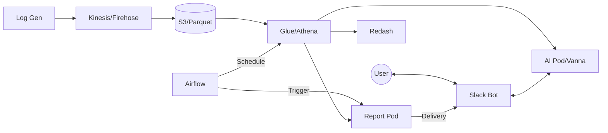

# 16. E2E 통합 검증 가이드

> **Phase**: 4 (E2E 통합 검증)  
> **담당**: DevOps Team  
> **상태**: 🔄 진행 중 (작성 완료)  
> **목적**: 데이터 수집부터 AI 분석, 리포트 배달까지 전체 파이프라인 연동 확인

---

## 1. 개요 및 아키텍처 흐름

본 검증은 시스템의 각 구성 요소가 단독으로 구동되는 것을 넘어, 데이터가 흐르고 서비스 간 명령이 전달되는 전체 과정을 테스트합니다. (알람 테스트는 이번 단계에서 보류합니다.)



---

## 2. [테스트 1] 데이터 파이프라인 및 자생적 스키마 검증
**목표**: 원시 데이터 저장부터 Athena를 통한 쿼리 가능 여부 확인

### Step 1.1: 로그 생성 및 S3 적재 확인
1.  **로그 생성기 실행** (로컬 또는 EC2):
    ```powershell
    python services/log-generator/main.py
    ```
2.  **S3 가공 데이터(Parquet) 확인**:
    ```powershell
    aws s3 ls s3://capa-data-lake-<ACCOUNT_ID>/raw/ --recursive --human-readable | Select-Object -Last 5
    ```

### Step 1.2: Glue Crawler 실행 (스키마 자동 인식)
1.  **Glue Crawler로 파티션/스키마 업데이트**:
    ```powershell
    # Crawler 시작 (수동 트리거)
    aws glue start-crawler --name capa-log-crawler
    
    # 상태 확인 (READY 상태로 돌아올 때까지 대기, 약 1~2분 소요)
    aws glue get-crawler --name capa-log-crawler --query "Crawler.State"
    ```

2.  **Athena에서 데이터 조회**:
    ```sql
    -- Athena Console 실행
    SELECT * FROM ad_events_raw LIMIT 10;
    ```
*   **성공 기준**: Crawler 실행 후 `ad_events_raw` 테이블이 생성되거나 업데이트되고, Athena에서 조회 시 데이터가 보여야 함.

---

## 3. [테스트 2] Airflow 워크플로우 연동 검증
**목표**: Airflow가 외부 서비스(Athena, Report)를 성공적으로 제어하는지 확인

### Step 2.1: Athena 집계 스케줄링 테스트 (수동 트리거)
1.  Airflow UI 접속 → `athena_daily_aggregation` DAG 활성화 및 **Trigger**.
2.  Athena 콘솔에서 집계 쿼리 실행 이력 확인.

### Step 2.2: 리포트 서비스 API 호출 테스트
1.  Airflow UI → `daily_report_generation` DAG 수동 **Trigger**.
2.  리포트 서비스 파드 로그 확인:
    ```bash
    kubectl logs -n <namespace> -l app=report-generator
    # 로그에 "POST /generate requested" 메시지 확인
    ```
*   **성공 기준**: Airflow의 Task들이 `Success` 상태로 종료되고, 대상 서비스에서 신호를 받아야 함.

---

## 4. [테스트 3] Athena 통합 데이터 소스 검증
**목표**: 모든 애플리케이션이 Athena 데이터를 정상적으로 소비하는지 확인

### Step 3.1: AI 파드 (Vanna AI) 연동
*   Vanna API `/generate_sql` 호출 시 Athena 메타데이터를 기반으로 올바른 쿼리가 생성되는지 확인.

### Step 3.2: 리포트 파드 데이터 리딩
*   리포트 생성 로직이 Athena에 접근하여 수치(KPI)를 정확히 가져오는지 파드 로그 확인.

### Step 3.3: Redash 대시보드 렌더링
*   Redash UI 접속 → Athena 데이터 소스 연결 확인 → 기본 대시보드 렌더링 성공 여부 확인.

---

## 5. [테스트 4] 슬랙(Slack) 통합 인터페이스 검증
**목표**: 사용자가 느끼는 최종 서비스 인터페이스의 통합성 확인

### Step 4.1: 자연어 기반 AI 질의 테스트
1.  슬랙 채널에서: `@capa-bot 어제 매출은 얼마였어?`
2.  **응답 확인**: AI 답변(텍스트) 및 추출된 SQL/결과 확인.

### Step 4.2: 리포트 배달 검증
1.  슬랙 채널에서 리포트 생성 요청 또는 Airflow 트리거 대기.
2.  리포트 파드가 슬랙으로 **최종 결과물(알림/파일)**을 전송하는지 확인.

---

## 6. 전체 체크리스트 및 결과 기록

| 테스트 단계 | 검증 항목 | 결과 (P/F) | 비고 |
| :--- | :--- | :---: | :--- |
| **Level 1** | S3 Parquet 파일 생성 | | |
| | Athena 데이터 조회 성공 | | |
| **Level 2** | Airflow Athena DAG 실행 | | |
| | Airflow Report API 호출 | | |
| **Level 3** | Vanna AI - Athena 연동 | | |
| | Redash 대시보드 출력 | | |
| **Level 4** | Slack Bot AI 질의 응답 | | |
| | Slack 리포트 결과 배달 | | |

---

## 7. 다음 단계
- [ ] 본 가이드를 바탕으로 테스트 수행 및 결과 기록
- [ ] 발견된 병목 구간(Latency) 최적화
- [ ] **[17_모니터링_기본.md](17_모니터링_기본.md)** 단계로 이동
