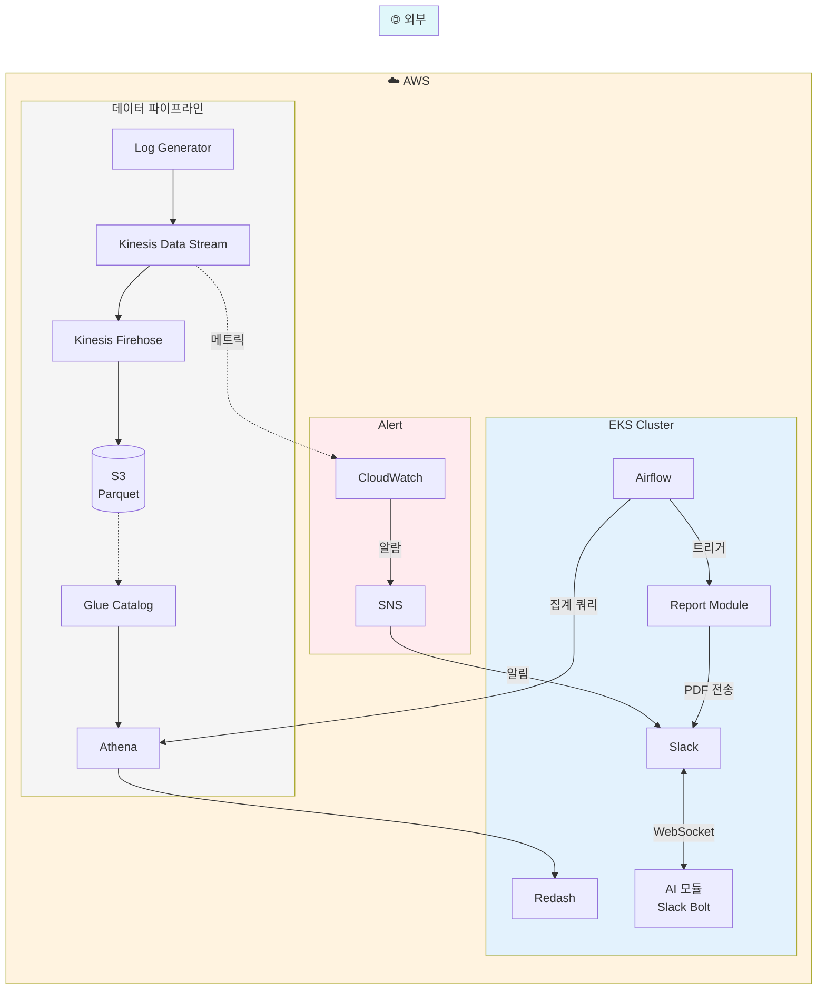

# CAPA MVP 일정 관리

## 개요

CAPA 프로젝트의 **MVP (Minimum Viable Product)** 구현 일정 및 범위를 정의합니다.

- **총 기간**: 10일
- **목표**: **E2E 파이프라인 연결 확인** (기능 구현 X, 길 뚫기 O)

---

## MVP 철학

> **MVP = 파이프라인 연결 + 기본 대시보드 동작**
> 
> LLM 호출, AI 분석, 고급 시각화는 확장 단계에서 구현

---

## MVP 아키텍처

> **MVP 원칙**: 인프라는 전부 구현, AI 로직만 빠짐



**MVP 핵심 흐름:**

| 번호 | 흐름 | 구현 범위 |
|:----:|------|----------|
| ① | 로그 → S3 | `Log Generator → Kinesis → S3 (Parquet)` |
| ② | S3 → Athena | `S3 → Glue Catalog → Athena 쿼리` |
| ③ | Alert | `CloudWatch → SNS → Slack 알림 도달` |
| ④ | Ask | `Slack → EKS 컨테이너 → Slack 응답` |
| ⑤ | Dashboard | `Airflow → Athena → Redash 차트` |
| ⑥ | Report | `Airflow → Report Generator → Slack` |

**MVP vs 확장:**

| 구분 | MVP (인프라 전체) | 확장 (AI 로직) |
|------|------------------|---------------|
| AI 모듈 | Socket Mode + echo 응답 | Events API + FastAPI + Vanna AI |
| Alert | CloudWatch 임계값 알람 | Prophet 시계열 예측 |
| Dashboard | 기본 KPI 차트 3개 | 드릴다운, AI 인사이트 |

---

## 10일 구현 일정

| 일차 | 작업 | 목표 | 산출물 |
|:----:|------|------|--------|
| **1-2** | 데이터 파이프라인 | 로그 → S3 도달 확인 | Kinesis → Firehose → S3 |
| **3-4** | 쿼리 환경 | Athena에서 데이터 조회 | Glue Catalog + Athena |
| **5-6** | Ask (Slack 연동) | Slack ↔ AI 모듈 연결 | EKS + AI 모듈 (Socket Mode) |
| **7** | Alert | 알림 도달 확인 | CloudWatch → SNS → Slack |
| **8-9** | Batch + Dashboard | 기본 KPI 대시보드 | Airflow → Athena → Redash |
| **10** | E2E 테스트 | 전체 파이프라인 동작 | 문서화 + 데모 |

---

## Phase별 상세

### Phase 1: 데이터 파이프라인 (Day 1-2)

**목표**: 로그 생성기 → S3까지 데이터 도달 확인

```
Log Generator → Kinesis Data Stream → Kinesis Firehose → S3 (Parquet)
```

**체크리스트:**
- [ ] Kinesis Data Stream 생성
- [ ] Kinesis Firehose 생성 (Parquet 변환)
- [ ] S3 버킷 생성
- [ ] Log Generator 실행 → S3에 파일 생성 확인

**완료 기준**: S3에 Parquet 파일이 쌓이면 성공

---

### Phase 2: 쿼리 환경 (Day 3-4)

**목표**: Athena에서 S3 데이터 조회 가능 확인

```
S3 (Parquet) → Glue Catalog → Athena
```

**체크리스트:**
- [ ] Glue Catalog 데이터베이스 생성
- [ ] Glue Crawler 또는 수동 테이블 생성
- [ ] Athena에서 `SELECT * FROM events LIMIT 10` 성공

**완료 기준**: Athena 쿼리 결과가 나오면 성공

---

### Phase 3: Ask - Slack 연동 (Day 5-6)

**목표**: Slack → EKS 컨테이너 → Slack 응답 (전체 인프라 구현, AI 로직만 빠짐)

```
사용자: @capa-bot 안녕
CAPA:   "안녕하세요! CAPA입니다." (하드코딩 응답, LLM X)
```

**체크리스트:**
- [ ] Slack App 생성 및 Bot Token 발급 (Socket Mode 활성화)
- [ ] AI 모듈 컨테이너 이미지 빌드 (Slack Bolt)
- [ ] EKS에 AI 모듈 Pod 배포
- [ ] Slack ↔ AI 모듈 연결 확인 (WebSocket)
- [ ] echo 응답 테스트

**완료 기준**: 슬랙에서 봇 멘션 → 응답 메시지 도착하면 성공

**MVP 기술 스택:**
- **Slack Bolt (Socket Mode)**: WebSocket으로 Slack 연결, HTTP 서버 불필요
- **확장 시**: Events API + FastAPI로 전환 가능

**MVP 코드 예시:**
```python
from slack_bolt import App

# Socket Mode: WebSocket 연결 (Ingress/FastAPI 불필요)
app = App(token=os.environ["SLACK_BOT_TOKEN"])

@app.event("app_mention")
def handle_mention(event, say):
    user = event["user"]
    # MVP: 하드코딩 응답 (LLM/Vanna 호출 X)
    say(f"<@{user}> 안녕하세요! CAPA입니다.")

if __name__ == "__main__":
    app.start()  # WebSocket 연결 시작
```

---

### Phase 4: Alert (Day 7)

**목표**: CloudWatch 알림 → 슬랙 도달 확인

```
CloudWatch Alarm → SNS → Slack (Lambda 또는 직접 연동)
```

**체크리스트:**
- [ ] CloudWatch Metric 생성 (로그 유입량)
- [ ] CloudWatch Alarm 생성 (임계값 테스트용)
- [ ] SNS Topic 생성
- [ ] SNS → Slack 연동 (AWS Chatbot 또는 Lambda)
- [ ] 알람 트리거 테스트

**완료 기준**: 알람 발생 → 슬랙 메시지 도착하면 성공

---

### Phase 5: Batch + Dashboard + Report (Day 8-9)

**목표**: Airflow로 집계 및 리포트 생성 → Redash 대시보드 및 Slack 전송

```
Airflow DAG → Athena 집계 → Redash / Report Generator
```

**체크리스트:**
- [ ] Airflow 환경 구성 (로컬 또는 EKS)
- [ ] 일별 집계 DAG 작성 (노출/클릭/전환)
- [ ] Redash 설치 및 Athena 연결
- [ ] 기본 KPI 대시보드 구성
- [ ] Report Generator 이미지 빌드 및 EKS 배포
- [ ] 리포트 생성 DAG 작성 및 테스트

**완료 기준**: 
1. Redash에서 차트 확인
2. Slack으로 리포트(PDF/텍스트) 수신 성공

**MVP DAG 예시:**
```python
# MVP: 일별 집계 쿼리
from airflow.providers.amazon.aws.operators.athena import AthenaOperator

with DAG("daily_kpi_aggregation", schedule_interval="@daily") as dag:
    aggregate_daily = AthenaOperator(
        task_id="aggregate_daily_kpi",
        query="""
            SELECT 
                date,
                COUNT(CASE WHEN event_type = 'impression' THEN 1 END) as impressions,
                COUNT(CASE WHEN event_type = 'click' THEN 1 END) as clicks,
                COUNT(CASE WHEN event_type = 'conversion' THEN 1 END) as conversions
            FROM events
            WHERE date = '{{ ds }}'
            GROUP BY date
        """,
        database="capa",
        output_location="s3://capa-athena-results/",
    )
```

**MVP 대시보드 구성:**

| 차트 | 설명 | 쿼리 |
|------|------|------|
| 일별 노출수 | 라인 차트 | `SELECT date, impressions FROM daily_kpi` |
| 일별 클릭수 | 라인 차트 | `SELECT date, clicks FROM daily_kpi` |
| 일별 전환수 | 라인 차트 | `SELECT date, conversions FROM daily_kpi` |

---

### Phase 7: E2E 테스트 (Day 10)

**목표**: 전체 파이프라인 E2E 동작 확인

**E2E 시나리오:**
```
1. Log Generator 실행 (10분)
2. S3에 Parquet 파일 확인
3. Athena에서 데이터 조회
4. Slack Bot 멘션 → 응답 확인
5. CloudWatch Alarm 트리거 → Slack 알림 확인
6. Airflow DAG 실행 → 일별 집계 성공
7. Redash 대시보드에서 일별 노출/클릭/전환 차트 확인
```

**체크리스트:**
- [ ] E2E 시나리오 문서화
- [ ] 전체 파이프라인 동작 확인
- [ ] 스크린샷/영상 캡처
- [ ] README 업데이트

---

## MVP 완료 기준 요약

| 컴포넌트 | 완료 기준 |
|----------|----------|
| **데이터 파이프라인** | S3에 Parquet 파일 생성 |
| **쿼리 환경** | Athena에서 SELECT 성공 |
| **Slack Bot** | 멘션 → 응답 메시지 도착 |
| **Alert** | 알람 → Slack 메시지 도착 |
| **Batch** | Airflow → Athena 일별 집계 실행 |
| **Dashboard** | Redash에서 일별 노출/클릭/전환 차트 확인 |

---

## 확장 구현 계획 (MVP 이후)

> MVP에서 **길을 뚫은 후**, 아래 실제 기능들을 순차적으로 구현합니다.

### 확장 1: Ask 기능 (Vanna AI + LLM)

**MVP 상태:**
```
사용자: @capa-bot 어제 CTR top 5
CAPA:   "메시지 수신 확인: 어제 CTR top 5" (echo)
```

**확장 후:**
```
사용자: @capa-bot 어제 CTR top 5
CAPA:   [결과 테이블] + [생성된 SQL]
```

**구현 항목:**
- [ ] Vanna AI 설치 및 설정
- [ ] ChromaDB 벡터 DB 구성
- [ ] OpenAI API 연동
- [ ] 광고 도메인 DDL/문서 학습
- [ ] Slack Bot 응답 로직 연결

---

### 확장 2: Alert 고도화 (시계열 예측)

**MVP 상태:**
```
CloudWatch: "로그 유입량 < 100" → Slack 알림
```

**확장 후:**
```
Prophet: "예상 CTR 2.5%, 실제 1.8%" → 이상 감지 → Slack 알림
```

**구현 항목:**
- [ ] Prophet 모델 학습 파이프라인
- [ ] 일별 예측값 생성 (Airflow)
- [ ] 신뢰구간 기반 이상 판정
- [ ] 비즈니스 KPI 모니터링 (CTR, CVR)

---

### 확장 3: Report 자동화

**MVP 상태:**
```
Airflow: Athena 쿼리만 실행
```

**확장 후:**
```
Airflow: 매주 월요일 09:00 → 리포트 생성 → Slack 전송
```

**구현 항목:**
- [ ] 리포트 템플릿 작성
- [ ] LLM 요약 연동
- [ ] PDF/Markdown 생성
- [ ] Slack 자동 전송

---

### 확장 4: Dashboard 고도화

**MVP 상태:**
```
Redash: 기본 KPI 대시보드 (일별 노출/클릭/전환 차트 3개)
```

**확장 후:**
```
Redash: 고급 대시보드 (칠페인별 비교, 전환 퍼널, 필터, 드릴다운)
```

**구현 항목:**
- [ ] 칠페인별 쿼리 추가
- [ ] 기간 필터 파라미터 추가
- [ ] 드릴다운 링크 구성
- [ ] 전환 퍼널 시각화

---

## 확장 구현 일정

| 단계 | 기간 | 목표 | 주요 작업 |
|:----:|------|------|----------|
| **확장 1** | MVP+1~2주 | Ask 기능 | Vanna AI + LLM 연동 |
| **확장 2** | MVP+3~4주 | Alert 고도화 | Prophet 시계열 예측 |
| **확장 3** | MVP+5~6주 | Report | 리포트 자동 생성 + Slack 전송 |
| **확장 4** | MVP+7~8주 | Dashboard 고도화 | 필터, 드릴다운, 전환 퍼널 |

---

## 리스크 및 대응

| 리스크 | 영향도 | 대응 방안 |
|--------|:------:|----------|
| AWS 연동 실패 | 높음 | 로컬 환경 대체 (LocalStack) |
| Slack API 권한 문제 | 중간 | 테스트 워크스페이스 사용 |
| Airflow 설정 복잡 | 중간 | Docker Compose로 로컬 실행 |
| 일정 지연 | 중간 | 우선순위: 파이프라인 > UI |

---

## 참고 문서

- [프로젝트 컨셉](./project_concept_v3.md)
- [아키텍처 상세](./architecture.md)
- [인프라 설정](../../infra/README.md)
