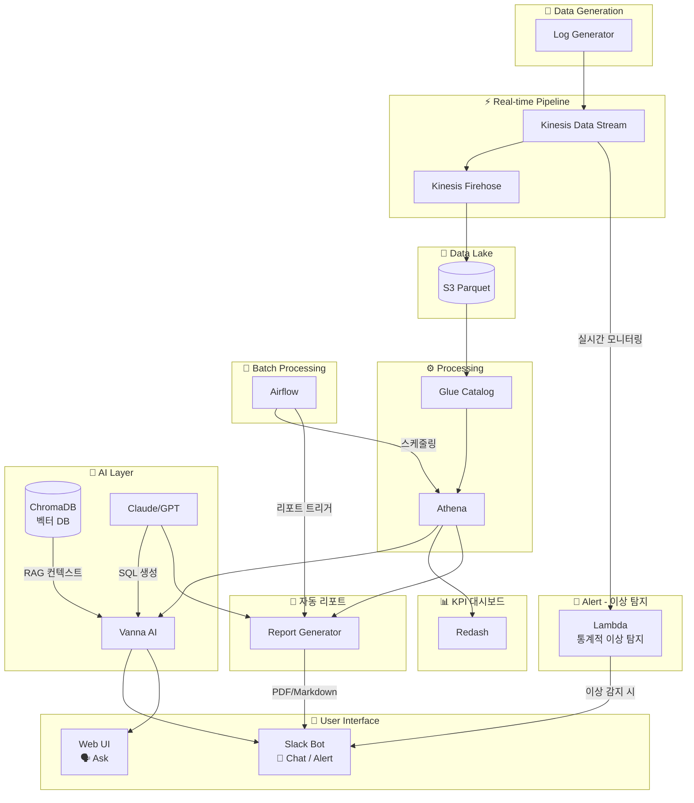
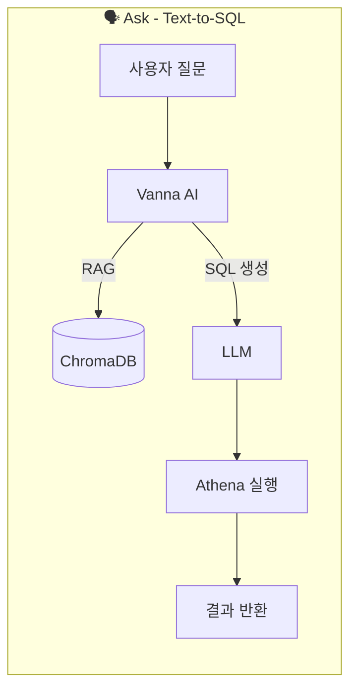
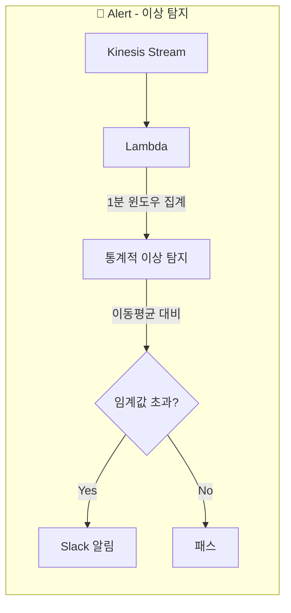
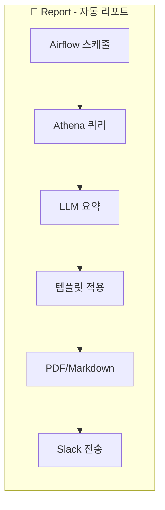
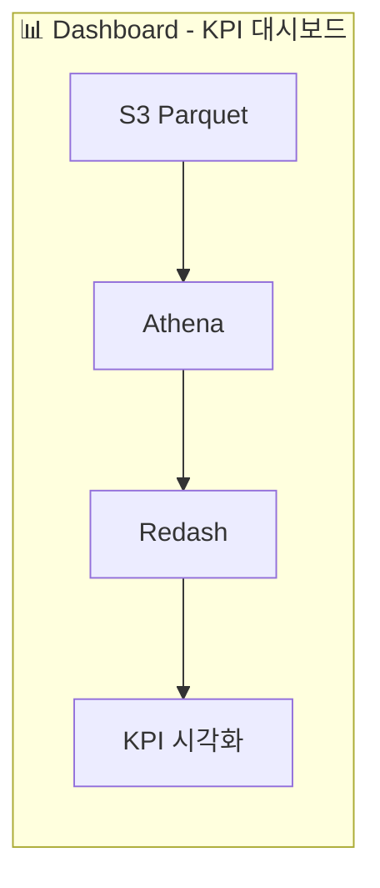
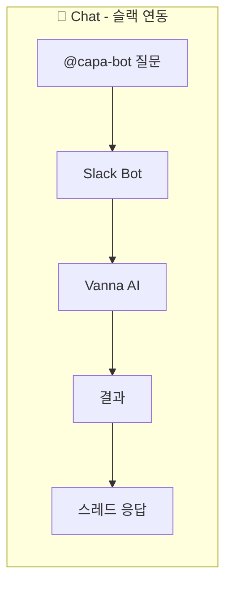

# CAPA 프로젝트 컨셉

## 프로젝트 정의

**CAPA (Cloud-native AI Pipeline for Ad-logs)**

> 광고 비즈니스의 비개발자가 자연어로 데이터와 대화하고,  
> AI가 이상을 먼저 알려주며, 리포트를 자동으로 생성하는 분석 플랫폼

---

## 타겟 사용자

**광고 비즈니스에서 데이터를 다루는 모든 비개발자**

- AD Ops (광고 운영)
- PM / 기획자
- 세일즈
- 퍼포먼스 마케터

공통점: SQL을 모르지만 데이터를 봐야 하는 사람들

---

## 문제 정의

**근거**: IAB & BWG, "State of Data 2026" 보고서  
**링크**: https://martech.org/75-of-marketers-say-their-measurement-systems-are-falling-short/

> "마케터 4명 중 3명(75%)이 현재 측정 시스템이 필요한 속도, 정확성, 신뢰성을 제공하지 못한다고 응답"

### 핵심 문제점

| 문제 | 현상 |
|------|------|
| 데이터 접근성 부족 | 데이터는 넘쳐나는데, 인사이트는 부족 |
| 분석 도구 진입장벽 | 분석 도구는 있는데, 쓸 줄 아는 사람은 적음 |
| 리포트 생산성 저하 | 리포트는 필요한데, 만드는 데 반나절 소요 |
| 사후 대응 | 문제 발생 후 다음날에야 인지 |

### 보고서 핵심 지적 vs CAPA 해결 방안

보고서는 마케터가 측정 시스템에서 **속도, 정확성, 신뢰성**이 부족하다고 지적합니다. CAPA는 이 세 가지를 다음과 같이 해결합니다:

| 보고서 지적 | 구체적 문제 | CAPA 해결 방안 | 관련 기능 |
|------------|------------|----------------|----------|
| **속도 부족** | 데이터 조회에 3시간~3일 소요, 리포트 작성에 반나절 | Text-to-SQL로 1분 내 조회, 리포트 자동 생성 | 🗣️ Ask, 📝 Report |
| **정확성 부족** | SQL 실수, 수동 집계 오류, 데이터 해석 오류 | AI가 SQL 생성하여 휴먼 에러 제거, RAG로 도메인 정확도 향상 | 🗣️ Ask, 💬 Chat |
| **신뢰성 부족** | 이상 징후 늦게 발견, 일관성 없는 리포트 | 실시간 이상 탐지 알림, 템플릿 기반 일관된 리포트 | 🔔 Alert, 📝 Report |

```
┌─────────────────────────────────────────────────────────────────────┐
│                    보고서 지적 → CAPA 해결                          │
├─────────────────────────────────────────────────────────────────────┤
│                                                                     │
│   [속도 부족]                                                        │
│   "데이터 접근이 너무 느려요"                                        │
│        ↓                                                            │
│   🗣️ Ask: 자연어 → SQL → 1분 내 결과                                │
│   📝 Report: "리포트 만들어줘" → 자동 생성                           │
│                                                                     │
│   [정확성 부족]                                                      │
│   "SQL 실수가 많아요, 데이터 해석이 어려워요"                        │
│        ↓                                                            │
│   🗣️ Ask: AI가 SQL 생성 (휴먼 에러 제거)                            │
│   💬 Chat: RAG 기반 도메인 용어 정확 해석                            │
│                                                                     │
│   [신뢰성 부족]                                                      │
│   "이상 징후를 너무 늦게 알아요"                                     │
│        ↓                                                            │
│   🔔 Alert: 로그 이상 감지 → 즉시 Slack 알림                        │
│   📝 Report: 템플릿 기반 일관된 품질                                 │
│                                                                     │
└─────────────────────────────────────────────────────────────────────┘
```

---

## 솔루션: CAPA 핵심 기능

| 기능 | 설명 | 해결하는 문제 |
|------|------|--------------|
| 🗣️ **Ask** | 자연어로 질문 → AI가 SQL로 답변 | 분석 도구 진입장벽 |
| 🔔 **Alert** | 이상 탐지 + 즉시 알림 | 사후 대응 → 선제 대응 |
| 📝 **Report** | 주간/월간 리포트 자동 생성 | 리포트 생산성 |
| 💬 **Chat** | 슬랙에서 바로 분석 | 데이터 접근성 |
| 📊 **Dashboard** | KPI 대시보드 (Redash) | SQL 몰라도 시각화된 데이터 확인 |

---

## Before / After

| 항목 | Before | After |
|------|--------|-------|
| 데이터 조회 | 데이터팀 요청 → 3시간~3일 대기 | @capa-bot 멘션 → 1분 내 답변 |
| 주간 리포트 | 데이터 수집 + 정리 + 작성 = 4시간 | "리포트 만들어줘" → 1분 내 생성 |
| 이상 감지 | 다음날 리포트에서 뒤늦게 인지 | AI가 이상 패턴 감지 → 즉시 알림 |
| KPI 확인 | SQL 몰라서 데이터팀 요청 | Redash 대시보드에서 직접 확인 |

---

## 기술 스택

### Data Pipeline
- Kinesis Data Stream → Firehose → S3 (Parquet) → Glue → Athena

### AI/ML
- Text-to-SQL: Vanna AI + ChromaDB + OpenAI API (GPT-4)
- Report: Claude/GPT API (요약, 인사이트 생성)
- Alert: Lambda (통계적 이상 탐지)

### Infrastructure
- Terraform + EKS + Airflow

### Interface
- Slack Bolt + FastAPI + Redash

---

## 아키텍처 개요



### 아키텍처 컴포넌트 설명

| 컴포넌트 | 역할 | 관련 기능 |
|----------|------|-----------|
| **Kinesis Data Stream** | 실시간 로그 수집 | 전체 |
| **Kinesis Firehose** | S3로 Parquet 변환 저장 | 전체 |
| **S3** | 데이터 레이크 (Parquet) | 전체 |
| **Glue Catalog** | 메타데이터 관리 | Ask, Report, Dashboard |
| **Athena** | SQL 쿼리 엔진 | Ask, Report, Dashboard |
| **Airflow** | 배치 작업 스케줄링 | Report |
| **Vanna AI** | Text-to-SQL 프레임워크 | Ask, Chat |
| **ChromaDB** | 벡터 DB (RAG용 임베딩 저장) | Ask, Chat |
| **Claude/GPT** | LLM (SQL 생성, 리포트 작성) | Ask, Chat, Report |
| **Lambda** | 통계적 이상 탐지 + 알림 전송 | Alert |
| **Report Generator** | 자동 리포트 생성 | Report |
| **Slack Bot** | 대화형 인터페이스 | Chat, Alert, Report |
| **Web UI** | 웹 기반 질의 인터페이스 | Ask |
| **Redash** | KPI 대시보드 (배치) | Dashboard |

---

## 기대 효과

| 지표 | 개선 |
|------|------|
| 데이터 조회 시간 | 3시간 → 1분 (99% 단축) |
| 리포트 작성 시간 | 4시간 → 1분 (99% 단축) |
| 이상 감지 시간 | D+1 → 1분 내 (실시간 자동 탐지) |
| KPI 확인 방식 | SQL 작성 필요 → 대시보드 직접 확인 |

---

## 기능별 데이터 플로우











---

## 확장 기능 상세

### 1. 🗣️ Ask - Text-to-SQL (핵심 기능)

**Martech.org 연결**: "분석 도구 민주화"

| 항목 | 내용 |
|------|------|
| 문제 | SQL을 모르면 데이터 조회 불가 |
| 해결 | 자연어 질문 → AI가 SQL 생성 → 결과 반환 |
| 예시 | "어제 캠페인별 CTR top 5 알려줘" |
| 기술 | Vanna AI + ChromaDB + Athena |

#### Vanna AI 상세

**Vanna AI란?**
오픈소스 Text-to-SQL 프레임워크입니다. 서비스가 아니라 Python 라이브러리로, RAG 기반으로 동작합니다.

```
[핵심 개념]
1. 학습 데이터 저장 (Vector DB에)
   - DDL (테이블 구조)
   - 예시 SQL 쿼리
   - 도메인 문서 (용어 설명 등)

2. 질문이 들어오면
   - Vector DB에서 유사한 컨텍스트 검색 (RAG)
   - LLM에게 "이 컨텍스트를 참고해서 SQL 생성해줘"
   - 생성된 SQL 반환
```

**CAPA에서 Vanna AI 사용 예시:**

```python
from vanna.chromadb import ChromaDB_VectorStore
from vanna.openai import OpenAI_Chat

# Vanna 설정 (ChromaDB + OpenAI 조합)
class MyVanna(ChromaDB_VectorStore, OpenAI_Chat):
    def __init__(self, config=None):
        ChromaDB_VectorStore.__init__(self, config=config)
        OpenAI_Chat.__init__(self, config=config)

vn = MyVanna(config={'api_key': 'sk-...', 'model': 'gpt-4'})

# 1. 학습 - DDL 등록
vn.train(ddl="""
    CREATE TABLE impressions (
        impression_id STRING,
        campaign_id STRING,
        bid_price DOUBLE,
        timestamp TIMESTAMP
    )
""")

# 2. 학습 - 예시 SQL 등록
vn.train(
    question="어제 캠페인별 노출수",
    sql="SELECT campaign_id, COUNT(*) FROM impressions WHERE date = current_date - 1 GROUP BY 1"
)

# 3. 학습 - 도메인 문서 등록
vn.train(documentation="CTR(클릭률)은 클릭수/노출수로 계산합니다.")

# 4. 질의 - 자연어 → SQL 생성
sql = vn.generate_sql("어제 캠페인별 CTR top 5 알려줘")
# → SELECT campaign_id, COUNT(DISTINCT click_id) / COUNT(DISTINCT impression_id) as ctr
#   FROM events WHERE date = current_date - 1 GROUP BY 1 ORDER BY ctr DESC LIMIT 5
```

#### ChromaDB 상세

**ChromaDB란?**
오픈소스 벡터 데이터베이스입니다. 텍스트를 임베딩(숫자 벡터)으로 변환해서 저장하고, 유사한 텍스트를 빠르게 검색합니다.

**CAPA에서 ChromaDB 역할:**

```
┌─────────────────────────────────────────────────────────────┐
│                    ChromaDB 저장 내용                       │
├─────────────────────────────────────────────────────────────┤
│                                                             │
│  📋 DDL (테이블 구조)                                       │
│     - impressions 테이블: impression_id, campaign_id, ...   │
│     - clicks 테이블: click_id, impression_id, cpc_cost, ... │
│     - conversions 테이블: ...                               │
│                                                             │
│  💾 예시 SQL                                                │
│     - "캠페인별 CTR" → SELECT ... GROUP BY campaign_id      │
│     - "일별 전환율" → SELECT ... GROUP BY date              │
│     - "CPC 평균" → SELECT AVG(cpc_cost) ...                 │
│                                                             │
│  📚 도메인 문서                                             │
│     - "CTR = 클릭수 / 노출수"                               │
│     - "CPC = Second Price Auction 기반"                     │
│     - "전환 = view_menu, add_to_cart, order"                │
│                                                             │
└─────────────────────────────────────────────────────────────┘
```

**RAG 검색 플로우:**

```
사용자: "어제 캠페인별 CTR"
           ↓
ChromaDB에서 유사 컨텍스트 검색:
  - 유사 DDL: impressions, clicks 테이블 구조
  - 유사 SQL: "캠페인별 CTR 계산" 예시
  - 유사 문서: "CTR = 클릭수 / 노출수"
           ↓
LLM에게 전달:
  "아래 컨텍스트를 참고해서 SQL 생성해줘"
  [검색된 DDL + SQL + 문서]
           ↓
SQL 생성 완료
```

### 2. 🔔 Alert - 이상 탐지 알림

**Martech.org 연결**: "연간/분기별 → 실시간 피드백 루프"

| 항목 | 내용 |
|------|------|
| 문제 | 파이프라인 장애나 트래픽 이상을 뒤늦게 인지 |
| 해결 | 로그 유입량 이상 감지 시 즉시 알림 |
| 예시 | "🚨 로그 유입량이 평소 대비 급감했습니다. 파이프라인을 확인해주세요." |
| 기술 | Kinesis → Lambda (통계적 이상 탐지) → Slack |

#### Lambda 통계적 이상 탐지 상세

**동작 원리:**
Lambda가 Kinesis Stream을 구독하여 1분 단위로 로그 수를 집계하고, 이동 평균 대비 급격한 변화를 감지합니다.

```
┌─────────────────────────────────────────────────────────────┐
│                  통계적 이상 탐지 플로우                     │
├─────────────────────────────────────────────────────────────┤
│                                                             │
│  [원본 로그]                                                 │
│  impression, click, conversion (개별 이벤트)                │
│       ↓                                                     │
│  [Lambda - 1분 윈도우 집계]                                 │
│  현재 1분간 로그 수: 45건                                   │
│       ↓                                                     │
│  [이동 평균 비교]                                           │
│  최근 10분 평균: 1,500건                                    │
│  현재/평균 비율: 45/1500 = 3%                               │
│       ↓                                                     │
│  비율 < 20% → 이상! (알림 전송)                             │
│  비율 > 300% → 이상! (트래픽 급증)                          │
│                                                             │
└─────────────────────────────────────────────────────────────┘
```

**Lambda 코드 예시:**

```python
import boto3
import json
from collections import deque
from datetime import datetime

# 최근 10분간의 로그 수 저장 (DynamoDB 또는 메모리)
recent_counts = deque(maxlen=10)

def lambda_handler(event, context):
    """Kinesis 이벤트를 받아 이상 탐지 수행"""
    
    # 1. 현재 배치의 로그 수 집계
    current_count = len(event['Records'])
    
    # 2. 이동 평균 계산
    if len(recent_counts) >= 5:
        moving_avg = sum(recent_counts) / len(recent_counts)
        
        # 3. 이상 탐지 (임계값 기반)
        if moving_avg > 0:
            ratio = current_count / moving_avg
            
            if ratio < 0.2:  # 80% 이상 감소
                send_alert(
                    level="critical",
                    message=f"🚨 로그 유입량 급감! 현재: {current_count}건/분, 평균: {moving_avg:.0f}건/분"
                )
            elif ratio > 3.0:  # 300% 이상 증가
                send_alert(
                    level="warning",
                    message=f"⚠️ 트래픽 급증 감지! 현재: {current_count}건/분, 평균: {moving_avg:.0f}건/분"
                )
    
    # 4. 현재 값 저장
    recent_counts.append(current_count)
    
    return {'statusCode': 200}

def send_alert(level: str, message: str):
    """Slack으로 알림 전송"""
    sns = boto3.client('sns')
    sns.publish(
        TopicArn='arn:aws:sns:...:capa-alerts',
        Message=json.dumps({
            'level': level,
            'message': message,
            'timestamp': datetime.now().isoformat()
        })
    )
```

**탐지 가능한 이상 패턴:**

| 이상 유형 | 조건 | 알림 예시 |
|----------|------|----------|
| 로그 급감 | 이동평균 대비 < 20% | "🚨 로그 유입량 급감! 파이프라인 확인 필요" |
| 로그 급증 | 이동평균 대비 > 300% | "⚠️ 트래픽 급증 감지" |
| 파이프라인 장애 | 로그 수 = 0 | "🔴 로그 유입 중단! 즉시 확인 필요" |

> **확장 아이디어**: 향후 SageMaker Endpoint에 Isolation Forest 모델을 배포하여 ML 기반 이상 탐지로 고도화 가능 (AI Layer 확장 아이디어 섹션 참고)

### 3. 📝 Report - 자연어 리포트 자동 생성

**Martech.org 연결**: "$62억 생산성 향상 - 루틴 업무 자동화"

| 항목 | 내용 |
|------|------|
| 문제 | 매주 PPT/보고서 작성에 반나절 소요 |
| 해결 | AI가 주간/월간 성과 리포트 자동 작성 |
| 예시 | "이번 주 캠페인 성과 리포트 만들어줘" → PDF/Markdown 생성 |
| 기술 | LLM + Jinja 템플릿 + Athena 데이터 |

#### Report Generator 상세

**Report Generator란?**
외부 서비스가 아니라 CAPA 내에서 직접 구현하는 Python 모듈입니다.

**구성 요소:**

```
┌─────────────────────────────────────────────────────────────┐
│               Report Generator 구성                         │
├─────────────────────────────────────────────────────────────┤
│                                                             │
│  1. Airflow DAG       - 스케줄링 (매주 월요일 9시 등)       │
│  2. Athena Client     - 데이터 조회 (SQL 실행)              │
│  3. LLM API           - 요약/인사이트 생성                  │
│  4. Jinja2 Template   - 리포트 포맷 (Markdown/HTML)         │
│  5. PDF Converter     - (선택) PDF 변환                     │
│  6. Slack Client      - 결과 전송                           │
│                                                             │
└─────────────────────────────────────────────────────────────┘
```

**Report Generator 코드 예시:**

```python
# src/report_generator/weekly_report.py

from jinja2 import Template
import boto3
from anthropic import Anthropic

class WeeklyReportGenerator:
    """주간 성과 리포트 자동 생성기"""
    
    def __init__(self):
        self.athena = boto3.client('athena')
        self.llm = Anthropic()
        
    def fetch_data(self, start_date: str, end_date: str) -> dict:
        """Athena에서 주간 데이터 조회"""
        
        # 1. 주요 KPI 쿼리
        kpi_query = f"""
        SELECT 
            COUNT(DISTINCT impression_id) as impressions,
            COUNT(DISTINCT click_id) as clicks,
            COUNT(DISTINCT CASE WHEN event_type = 'order' THEN conversion_id END) as conversions,
            ROUND(COUNT(DISTINCT click_id) * 100.0 / COUNT(DISTINCT impression_id), 2) as ctr,
            ROUND(SUM(cpc_cost), 2) as total_cost
        FROM ad_events
        WHERE date BETWEEN '{start_date}' AND '{end_date}'
        """
        
        # 2. 캠페인별 성과 쿼리
        campaign_query = f"""
        SELECT 
            campaign_id,
            COUNT(DISTINCT impression_id) as impressions,
            ROUND(COUNT(DISTINCT click_id) * 100.0 / COUNT(DISTINCT impression_id), 2) as ctr
        FROM ad_events
        WHERE date BETWEEN '{start_date}' AND '{end_date}'
        GROUP BY campaign_id
        ORDER BY ctr DESC
        LIMIT 10
        """
        
        return {
            'kpi': self._execute_query(kpi_query),
            'top_campaigns': self._execute_query(campaign_query)
        }
    
    def generate_insights(self, data: dict) -> str:
        """LLM으로 인사이트 생성"""
        
        prompt = f"""
        아래 광고 성과 데이터를 분석해서 핵심 인사이트 3가지를 작성해주세요.
        
        [데이터]
        {data}
        
        형식:
        1. 긍정적 트렌드
        2. 개선 필요 영역
        3. 권장 액션
        """
        
        response = self.llm.messages.create(
            model="claude-sonnet-4-20250514",
            max_tokens=500,
            messages=[{"role": "user", "content": prompt}]
        )
        
        return response.content[0].text
    
    def render_report(self, data: dict, insights: str) -> str:
        """Jinja2 템플릿으로 리포트 렌더링"""
        
        template = Template("""
# 📊 주간 광고 성과 리포트

**기간**: {{ start_date }} ~ {{ end_date }}

## 📈 주요 KPI

| 지표 | 값 | 전주 대비 |
|------|-----|----------|
| 총 노출 | {{ kpi.impressions | format_number }} | {{ kpi.impressions_change }} |
| 총 클릭 | {{ kpi.clicks | format_number }} | {{ kpi.clicks_change }} |
| CTR | {{ kpi.ctr }}% | {{ kpi.ctr_change }} |
| 전환 | {{ kpi.conversions | format_number }} | {{ kpi.conversions_change }} |

## 🏆 Top 캠페인


{{ loop.index }}. **{{ campaign.campaign_id }}** - CTR {{ campaign.ctr }}%


## 💡 AI 인사이트

{{ insights }}

---
*이 리포트는 CAPA Report Generator가 자동 생성했습니다.*
        """)
        
        return template.render(
            start_date=data['start_date'],
            end_date=data['end_date'],
            kpi=data['kpi'],
            top_campaigns=data['top_campaigns'],
            insights=insights
        )
    
    def generate(self, start_date: str, end_date: str) -> str:
        """리포트 생성 메인 함수"""
        
        # 1. 데이터 조회
        data = self.fetch_data(start_date, end_date)
        
        # 2. AI 인사이트 생성
        insights = self.generate_insights(data)
        
        # 3. 리포트 렌더링
        report = self.render_report(data, insights)
        
        return report
```

**Airflow DAG 예시:**

```python
# airflow/dags/weekly_report_dag.py

from airflow import DAG
from airflow.operators.python import PythonOperator
from datetime import datetime, timedelta

def generate_and_send_report():
    """주간 리포트 생성 및 슬랙 전송"""
    from report_generator.weekly_report import WeeklyReportGenerator
    from slack_sdk import WebClient
    
    # 1. 리포트 생성
    generator = WeeklyReportGenerator()
    report = generator.generate(
        start_date=(datetime.now() - timedelta(days=7)).strftime('%Y-%m-%d'),
        end_date=(datetime.now() - timedelta(days=1)).strftime('%Y-%m-%d')
    )
    
    # 2. 슬랙 전송
    slack = WebClient(token=os.environ['SLACK_TOKEN'])
    slack.chat_postMessage(
        channel='#marketing-reports',
        text=report
    )

with DAG(
    'weekly_ad_report',
    schedule_interval='0 9 * * MON',  # 매주 월요일 9시
    start_date=datetime(2026, 1, 1),
    catchup=False
) as dag:
    
    generate_report = PythonOperator(
        task_id='generate_weekly_report',
        python_callable=generate_and_send_report
    )
```

**리포트 생성 플로우:**

```
[Airflow 스케줄러]
     ↓ (매주 월요일 9시)
[Athena 데이터 조회]
     ↓ (주간 KPI, 캠페인별 성과)
[LLM 인사이트 생성]
     ↓ (Claude/GPT가 데이터 분석)
[Jinja2 템플릿 렌더링]
     ↓ (Markdown/HTML 포맷)
[Slack 전송]
     ↓
📊 #marketing-reports 채널에 자동 게시
```

### 4. 💬 Chat - 슬랙 연동 대화형 BI

**Martech.org 연결**: "분석 도구 민주화"

| 항목 | 내용 |
|------|------|
| 문제 | 분석 도구에 접속해야만 데이터 확인 가능 |
| 해결 | 슬랙에서 바로 질문 → 답변 |
| 예시 | `@capa-bot 어제 전환율 top 5 캠페인` |
| 기술 | Slack Bolt + FastAPI + Vanna |

### 5. 📊 Dashboard - KPI 대시보드

**Martech.org 연결**: "분석 도구 민주화"

| 항목 | 내용 |
|------|------|
| 문제 | SQL 작성 없이는 KPI 확인 불가 |
| 해결 | 시각화된 대시보드로 KPI 한눈에 확인 |
| 예시 | 일별 노출/클릭/전환 추이, 캠페인별 CTR 비교 |
| 기술 | Athena → Redash |

**실시간이 아닌 이유:**
- 광고 성과 분석은 대부분 일별/주별 단위로 충분
- 실시간 대시보드(OpenSearch + Grafana) 비용 대비 효용 낮음
- 이상 감지는 Alert 기능(RCF)으로 별도 처리

### 구현 우선순위

| 순위 | 기능 | 난이도 | 임팩트 |
|:----:|------|:------:|:------:|
| 1 | Text-to-SQL (Ask) | 중 | 높음 |
| 2 | 슬랙 연동 (Chat) | 낮음 | 높음 |
| 3 | 자동 리포트 (Report) | 중 | 높음 |
| 4 | 이상 탐지 (Alert) | 낮음 | 중간 |
| 5 | KPI 대시보드 (Dashboard) | 낮음 | 중간 |

---

## PR 스토리라인

### 1. Hook (문제 제기) - 30초

```
"마케터 4명 중 3명이 현재 측정 시스템에 불만족합니다."
                                    - IAB & BWG, State of Data 2026

왜일까요?

❌ 데이터는 넘쳐나는데, 인사이트는 부족하고
❌ 분석 도구는 있는데, 쓸 줄 아는 사람은 적고  
❌ 리포트는 필요한데, 만드는 데 반나절이 걸립니다.
```

### 2. Problem Deep Dive - 1분

```
┌─────────────────────────────────────────────────────────────┐
│                    마케터의 하루                              │
├─────────────────────────────────────────────────────────────┤
│                                                             │
│  09:00  "어제 캠페인 CTR 확인해야지"                         │
│         → BI 도구 접속, 필터 설정, 로딩... 15분              │
│                                                             │
│  10:00  "지난주 대비 전환율 비교하고 싶은데..."              │
│         → 데이터팀에 슬랙 요청                               │
│         → "확인해서 알려드릴게요" → 3시간 후 답변            │
│                                                             │
│  14:00  "주간 리포트 만들어야 하는데..."                     │
│         → 데이터 추출 → 엑셀 정리 → PPT 작성 → 4시간        │
│                                                             │
│  18:00  퇴근 후 발견: "어? CTR이 어제부터 급락했네?"         │
│         → 이미 하루치 광고비 날림                            │
│                                                             │
└─────────────────────────────────────────────────────────────┘

💡 핵심 문제: 데이터 접근성 부족 + 분석 속도 지연 + 사후 대응
```

### 3. Solution Introduction - 1분

```
┌─────────────────────────────────────────────────────────────┐
│                                                             │
│              CAPA: AI-Powered Ad Analytics                  │
│     Cloud-native AI Pipeline for Ad-logs                    │
│                                                             │
│     "마케터가 데이터와 대화하는 새로운 방식"                  │
│                                                             │
└─────────────────────────────────────────────────────────────┘

CAPA는 5가지 핵심 기능으로 마케터의 데이터 역량을 강화합니다:

  🗣️ Ask       - 자연어로 질문하면 AI가 SQL로 답변
  🔔 Alert     - 로그 이상 감지 시 즉시 알림  
  📝 Report    - 주간/월간 리포트 자동 생성
  💬 Chat      - 슬랙에서 바로 분석
  📊 Dashboard - Redash KPI 대시보드
```

### 4. Before → After - 1분

```
┌──────────────────────┬──────────────────────┐
│       Before         │        After         │
├──────────────────────┼──────────────────────┤
│                      │                      │
│  "CTR 알려줘"        │  "CTR 알려줘"        │
│       ↓              │       ↓              │
│  데이터팀 요청       │  @capa-bot 멘션      │
│       ↓              │       ↓              │
│  3시간~3일 대기      │  ⚡ 1분 내 답변       │
│                      │                      │
├──────────────────────┼──────────────────────┤
│                      │                      │
│  주간 리포트         │  주간 리포트         │
│       ↓              │       ↓              │
│  데이터 수집 1시간   │  "리포트 만들어줘"   │
│  엑셀 정리 1시간     │       ↓              │
│  PPT 작성 2시간      │  ⚡ 1분 내 생성       │
│       ↓              │                      │
│  총 4시간            │                      │
│                      │                      │
├──────────────────────┼──────────────────────┤
│                      │                      │
│  CTR 급락 발견       │  CTR 급락 발생       │
│       ↓              │       ↓              │
│  다음날 리포트에서   │  ⚡ 즉시 슬랙 알림    │
│  뒤늦게 인지         │  "CTR 15% 하락,      │
│       ↓              │   원인 분석 필요"    │
│  💸 광고비 손실      │       ↓              │
│                      │  🛡️ 즉시 대응        │
│                      │                      │
└──────────────────────┴──────────────────────┘
```

### 5. Key Features Demo - 2분

**Feature 1: 🗣️ Ask - 자연어 데이터 조회**
```
User: @capa-bot 어제 캠페인별 CTR top 5 알려줘

CAPA: 📊 어제(2026-02-08) 캠페인별 CTR Top 5입니다.

| 순위 | 캠페인      | 노출수    | CTR    |
|------|-------------|-----------|--------|
| 1    | 설날_프로모 | 1,234,567 | 3.24%  |
| 2    | 신규가입    |   987,654 | 2.87%  |
| ...  | ...         | ...       | ...    |

🔗 Redash에서 자세히 보기
```

**Feature 2: 🔔 Alert - 이상 탐지 알림**
```
🚨 CAPA Alert

로그 유입량이 비정상적으로 감소했습니다.

• 현재 유입량: 45건/분 (최근 10분 평균: 1,500건/분)
• 감소율: 97%
• 감지 시각: 14:32
• 예상 원인: 파이프라인 장애 또는 광고 시스템 오류

[파이프라인 상태 확인] [광고 플랫폼 확인] [무시하기]
```

**Feature 3: 📝 Report - 자동 리포트 생성**
```
User: @capa-bot 지난주 성과 리포트 만들어줘

CAPA: 📄 2026년 2월 1주차 광고 성과 리포트

📈 주요 지표 요약
• 총 노출: 12.3M (+8% WoW)
• 평균 CTR: 2.4% (+0.3%p)
• 전환율: 1.8% (-0.2%p)
• ROAS: 320% (+15%p)

🏆 Top 캠페인: 설날_프로모 (CTR 3.2%, 전환 2.1%)
⚠️ 개선 필요: 신규가입_B안 (CTR 0.8%, 업계 평균 하회)

[PDF 다운로드] [슬라이드로 보기]
```

### 6. 기술 스택 & 차별화 - 1분

```
┌─────────────────────────────────────────────────────────────┐
│              vs 기존 Text-to-SQL 솔루션                     │
├─────────────────────────────────────────────────────────────┤
│                                                             │
│              기존 솔루션             CAPA                   │
│              ───────────             ────                   │
│  데이터      기존 DB 활용            End-to-End 파이프라인  │
│  도메인      범용                    광고 로그 특화         │
│  대응        수동 조회               프로액티브 알림        │
│  리포트      수동 생성               AI 자동 생성           │
│  접근성      웹 UI만                 Slack 완전 연동        │
│                                                             │
└─────────────────────────────────────────────────────────────┘
```

### 7. 마무리 - 30초

```
┌─────────────────────────────────────────────────────────────┐
│                                                             │
│  "CAPA는 마케터에게 데이터 팀을 선물합니다.                 │
│   24시간 대기하고, 절대 지치지 않는 AI 데이터 팀을."        │
│                                                             │
└─────────────────────────────────────────────────────────────┘
```

### Elevator Pitch (한 줄 요약)

> **"CAPA는 광고 마케터가 자연어로 데이터와 대화하고, AI가 먼저 이상을 알려주며, 리포트를 자동으로 만들어주는 클라우드 네이티브 분석 플랫폼입니다."**

---

## AI Layer 확장 아이디어 (Advanced)

AI Layer에 최신 기술을 적용하여 Text-to-SQL 품질을 향상시키는 확장 아이디어입니다.

### 1. DSPy - 프롬프트 자동 최적화

**DSPy란?** Stanford에서 만든 LLM 프로그래밍 프레임워크. 프롬프트를 수동으로 작성하는 대신, 파이프라인을 정의하면 자동으로 최적화.

**CAPA 적용:**

```python
import dspy

class TextToSQL(dspy.Module):
    def __init__(self):
        self.generate_sql = dspy.ChainOfThought("question, schema -> sql")
        self.validate_sql = dspy.Predict("sql, schema -> is_valid, feedback")
    
    def forward(self, question, schema):
        sql = self.generate_sql(question=question, schema=schema)
        validation = self.validate_sql(sql=sql.sql, schema=schema)
        
        if not validation.is_valid:
            # 자동 재시도
            sql = self.generate_sql(
                question=question, 
                schema=schema,
                feedback=validation.feedback
            )
        return sql

# 자동 최적화 (예시 데이터로 프롬프트 튜닝)
optimizer = dspy.BootstrapFewShot(metric=sql_accuracy_metric)
optimized_module = optimizer.compile(TextToSQL(), trainset=examples)
```

**장점:**
- 프롬프트 엔지니어링 자동화
- Few-shot 예시 자동 선택
- 정확도 기반 최적화

---

### 2. LLM-as-a-Judge - SQL 품질 자동 평가

**개념:** 생성된 SQL의 품질을 다른 LLM이 평가

**CAPA 적용:**

```python
class SQLJudge:
    """생성된 SQL을 평가하는 LLM Judge"""
    
    def evaluate(self, question: str, generated_sql: str, schema: str) -> dict:
        prompt = f"""
        다음 SQL을 평가해주세요.
        
        [질문] {question}
        [스키마] {schema}
        [생성된 SQL] {generated_sql}
        
        평가 기준:
        1. 문법 정확성 (1-5)
        2. 질문 의도 반영 (1-5)
        3. 효율성 (1-5)
        4. 개선 제안
        
        JSON으로 응답:
        """
        
        return llm.generate(prompt)
```

**활용 플로우:**

```
[질문] → [SQL 생성 LLM] → [생성된 SQL]
                               ↓
                      [LLM-as-a-Judge]
                               ↓
               ┌───────────────┴───────────────┐
               ↓                               ↓
         점수 >= 4                        점수 < 4
               ↓                               ↓
          [실행]                    [피드백으로 재생성]
```

---

### 3. RLAIF - AI 피드백 기반 강화학습

**개념:** 사람 피드백 대신 AI 피드백으로 모델 개선

**CAPA 적용 - 자동 학습 루프:**

```python
class RLAIFLoop:
    def __init__(self, generator, judge, vector_db):
        self.generator = generator
        self.judge = judge
        self.vector_db = vector_db
    
    def improve(self, question: str, schema: str):
        # 1. 여러 SQL 후보 생성
        candidates = [
            self.generator.generate(question, schema, temperature=0.7)
            for _ in range(3)
        ]
        
        # 2. Judge가 평가
        scores = [
            self.judge.evaluate(question, sql, schema)
            for sql in candidates
        ]
        
        # 3. 최고 점수 SQL 선택
        best_idx = max(range(len(scores)), key=lambda i: scores[i]['total'])
        best_sql = candidates[best_idx]
        
        # 4. 좋은 예시로 저장 (RAG 품질 향상)
        if scores[best_idx]['total'] >= 4.5:
            self.vector_db.add_training_data(
                question=question,
                sql=best_sql,
                score=scores[best_idx]['total']
            )
        
        return best_sql
```

**학습 루프:**

```
1. 사용자 질문 수집
   ↓
2. SQL 생성 (여러 후보)
   ↓
3. LLM-as-a-Judge가 후보들 순위 매김
   ↓
4. 최고 점수 SQL을 "선호 데이터"로 저장
   ↓
5. ChromaDB에 좋은 예시로 추가 (RAG 품질 향상)
   ↓
6. (선택) Fine-tuning 데이터로 활용
```

---

### 4. A2A (Agent-to-Agent) - 멀티 에이전트 협업

**개념:** 여러 전문 에이전트가 협업해서 문제 해결

**CAPA 적용:**

```
[사용자 질문]
     ↓
┌─────────────────────────────────────────────┐
│           Orchestrator Agent                 │
│        (질문 분석 + 작업 분배)               │
└─────────────────────────────────────────────┘
     ↓                    ↓                    ↓
┌─────────┐        ┌─────────┐        ┌─────────┐
│ Schema  │        │   SQL   │        │ Domain  │
│ Agent   │        │ Agent   │        │ Agent   │
│         │        │         │        │         │
│ 테이블/ │        │ SQL문   │        │ 광고    │
│ 컬럼    │        │ 작성    │        │ 용어    │
│ 추천    │        │ 전문가  │        │ 해석    │
└────┬────┘        └────┬────┘        └────┬────┘
     └─────────────────┼─────────────────┘
                       ↓
              [최종 SQL + 설명]
```

```python
class MultiAgentSQLSystem:
    def __init__(self):
        self.schema_agent = SchemaAgent()    # 테이블/컬럼 전문
        self.sql_agent = SQLAgent()          # SQL 작성 전문
        self.domain_agent = DomainAgent()    # 광고 도메인 전문
        self.orchestrator = Orchestrator()   # 조율자
    
    async def generate(self, question: str):
        # 1. 질문 분석
        analysis = await self.orchestrator.analyze(question)
        
        # 2. 병렬로 각 에이전트 호출
        schema_info = await self.schema_agent.get_relevant_tables(question)
        domain_context = await self.domain_agent.interpret(question)
        
        # 3. SQL Agent가 종합해서 SQL 생성
        sql = await self.sql_agent.generate(
            question=question,
            tables=schema_info,
            context=domain_context
        )
        
        # 4. 결과 검증 및 반환
        return await self.orchestrator.validate_and_return(sql)
```

---

### 5. RALF Loop - RAG + 피드백 지속 학습

**개념:** RAG + 피드백 루프를 결합한 지속적 학습

**CAPA 적용:**

```
┌──────────────────────────────────────────────────────┐
│                    운영 단계                          │
│                                                      │
│   질문 → RAG 검색 → SQL 생성 → 실행 → 결과          │
│                                        ↓             │
│                               [사용자 피드백]        │
│                               👍 or 👎              │
└──────────────────────────────────────────────────────┘
                           ↓
┌──────────────────────────────────────────────────────┐
│                    학습 단계                          │
│                                                      │
│   👍 피드백 → ChromaDB에 좋은 예시로 추가            │
│   👎 피드백 → 실패 패턴 분석 → 프롬프트 개선         │
│                                                      │
└──────────────────────────────────────────────────────┘
                           ↓
                  [RAG 품질 점진적 향상]
```

**Slack 피드백 UI 예시:**

```
@capa-bot 어제 캠페인별 CTR 알려줘

CAPA: 📊 결과입니다.
| campaign_id | ctr |
|-------------|-----|
| campaign_A  | 2.3%|
| ...         | ... |

이 답변이 도움이 되었나요?
[👍 정확해요] [👎 틀렸어요] [✏️ 수정 제안]
```

---

### 통합 아키텍처 (Enhanced AI Layer v2)

```
┌─────────────────────────────────────────────────────────────┐
│                 Enhanced AI Layer (v2)                      │
├─────────────────────────────────────────────────────────────┤
│                                                             │
│  ┌─────────────┐    ┌─────────────┐    ┌─────────────┐     │
│  │    DSPy     │    │  A2A Multi  │    │   RLAIF     │     │
│  │  Pipeline   │    │   Agent     │    │   Loop      │     │
│  │             │    │             │    │             │     │
│  │ 프롬프트    │    │ Schema/SQL/ │    │ AI 피드백   │     │
│  │ 자동최적화  │    │ Domain 협업 │    │ 기반 학습   │     │
│  └──────┬──────┘    └──────┬──────┘    └──────┬──────┘     │
│         └──────────────────┼──────────────────┘            │
│                            ↓                                │
│                   ┌─────────────┐                          │
│                   │ LLM-as-Judge│                          │
│                   │ (품질 평가) │                          │
│                   └──────┬──────┘                          │
│                          ↓                                  │
│                   ┌─────────────┐                          │
│                   │ RALF Loop   │                          │
│                   │ (지속 학습) │                          │
│                   └─────────────┘                          │
│                                                             │
└─────────────────────────────────────────────────────────────┘
```

---

### 6. ML 기반 이상 탐지 (Alert 고도화)

**현재 구현:** Lambda + 통계적 이상 탐지 (이동 평균 기반)

**확장 방안:** SageMaker Endpoint에 ML 모델을 배포하여 더 정교한 이상 탐지

**옵션 A: Isolation Forest**

```python
# SageMaker Endpoint로 배포된 Isolation Forest 모델 호출
import boto3

def detect_anomaly_ml(current_metrics: dict) -> bool:
    """ML 모델로 이상 탐지"""
    
    sagemaker = boto3.client('sagemaker-runtime')
    
    response = sagemaker.invoke_endpoint(
        EndpointName='capa-anomaly-detector',
        ContentType='application/json',
        Body=json.dumps({
            'impression_count': current_metrics['impressions'],
            'click_count': current_metrics['clicks'],
            'conversion_count': current_metrics['conversions']
        })
    )
    
    result = json.loads(response['Body'].read())
    return result['is_anomaly']  # True/False
```

**옵션 B: Amazon Lookout for Metrics**

AWS 완전관리형 이상 탐지 서비스로, 별도 모델 학습 없이 자동으로 이상 패턴을 감지합니다.

**비교:**

| 방식 | 장점 | 단점 | 추천 상황 |
|------|------|------|----------|
| Lambda + 통계 | 간단, 저비용 | 단순 패턴만 | MVP, 초기 단계 |
| SageMaker + Isolation Forest | 복잡한 패턴 | 모델 관리 필요 | 고도화 단계 |
| Lookout for Metrics | 완전관리형 | 비용 높음 | 운영 리소스 부족 시 |

---

### 7. dbt (Data Build Tool) - 데이터 모델링 레이어

**dbt란?**
SQL 기반 데이터 변환(Transformation) 도구입니다. ELT 파이프라인의 T를 담당하며, 원본 데이터를 분석에 최적화된 Mart 테이블로 변환합니다.

**현재 구조 vs dbt 도입 시:**

```
[현재]
S3 (Parquet) → Glue → Athena → Vanna AI
                        │
              원본 테이블 직접 쿼리
              (impressions, clicks, conversions)

[dbt 도입 시]
S3 (Parquet) → Glue → Athena
                        │
                       dbt
                        │
              ┌─────────┴─────────┐
              ▼                   ▼
        [Staging Layer]     [Mart Layer]
        - stg_impressions   - mart_campaign_daily
        - stg_clicks        - mart_campaign_hourly  
        - stg_conversions   - mart_funnel
                                  │
                                  ▼
                            Vanna AI
                      (정리된 Mart 테이블 쿼리)
```

**도입 정당성:**

| 이유 | 설명 | CAPA 연관성 |
|------|------|-------------|
| **Text-to-SQL 정확도 향상** | 잘 정리된 Mart 테이블은 LLM이 이해하기 쉬움 | Vanna AI 품질 향상 |
| **쿼리 성능 개선** | 미리 집계된 테이블 → Athena 스캔 비용 감소 | 응답 속도 향상, 비용 절감 |
| **데이터 품질 테스트** | not_null, unique, relationship 테스트 | 리포트 신뢰성 향상 |
| **비즈니스 로직 표준화** | CTR, CVR 계산 로직을 한 곳에서 관리 | 일관성 있는 지표 |
| **문서화** | 테이블/컬럼 설명 자동 생성 | ChromaDB 학습 데이터로 활용 |

**Text-to-SQL 관점에서의 이점:**

```
[dbt 없이]
User: "어제 캠페인별 CTR 알려줘"

Vanna AI가 생성해야 하는 SQL:
  SELECT 
    campaign_id,
    COUNT(DISTINCT i.impression_id) as impressions,
    COUNT(DISTINCT c.click_id) as clicks,
    ROUND(COUNT(DISTINCT c.click_id) * 100.0 / 
          NULLIF(COUNT(DISTINCT i.impression_id), 0), 2) as ctr
  FROM impressions i
  LEFT JOIN clicks c ON i.event_id = c.impression_id
  WHERE DATE(i.timestamp) = DATE_ADD('day', -1, CURRENT_DATE)
  GROUP BY campaign_id
  
→ 복잡한 JOIN + 계산 로직 → 오류 가능성 높음

[dbt 있으면]
User: "어제 캠페인별 CTR 알려줘"

Vanna AI가 생성하는 SQL:
  SELECT campaign_id, ctr
  FROM mart_campaign_daily
  WHERE date = DATE_ADD('day', -1, CURRENT_DATE)
  
→ 단순 SELECT → 정확도 높음
```

**dbt 모델 예시:**

```sql
-- models/mart/mart_campaign_daily.sql

{{ config(materialized='table') }}

WITH impressions AS (
    SELECT * FROM {{ ref('stg_impressions') }}
),

clicks AS (
    SELECT * FROM {{ ref('stg_clicks') }}
),

conversions AS (
    SELECT * FROM {{ ref('stg_conversions') }}
)

SELECT
    i.campaign_id,
    DATE(i.timestamp) AS date,
    COUNT(DISTINCT i.impression_id) AS impressions,
    COUNT(DISTINCT c.click_id) AS clicks,
    COUNT(DISTINCT cv.conversion_id) AS conversions,
    ROUND(COUNT(DISTINCT c.click_id) * 100.0 / 
          NULLIF(COUNT(DISTINCT i.impression_id), 0), 2) AS ctr,
    ROUND(COUNT(DISTINCT cv.conversion_id) * 100.0 / 
          NULLIF(COUNT(DISTINCT c.click_id), 0), 2) AS cvr
FROM impressions i
LEFT JOIN clicks c ON i.event_id = c.impression_id
LEFT JOIN conversions cv ON c.event_id = cv.click_id
GROUP BY 1, 2
```

**도입 시점:**

| 단계 | 시점 | 내용 |
|:----:|------|------|
| 1단계 (현재) | MVP | dbt 없이 진행, 원본 테이블 직접 쿼리 |
| 2단계 (확장) | Text-to-SQL 정확도 이슈 발생 시 | dbt 도입, Mart 레이어 추가 |
| 3단계 (고도화) | 테이블 10개 이상, 팀 확장 시 | 전체 데이터 모델 dbt로 관리 |

---

### 확장 기술 구현 우선순위

| 순위 | 기술 | 난이도 | 임팩트 | 추천 이유 |
|:----:|------|:------:|:------:|-----------|
| 1 | **LLM-as-a-Judge** | 낮음 | 높음 | 구현 쉽고 즉시 품질 향상 |
| 2 | **RALF Loop** | 중간 | 높음 | 사용자 피드백으로 지속 개선 |
| 3 | **dbt** | 중간 | 높음 | Text-to-SQL 정확도 + 쿼리 성능 |
| 4 | **DSPy** | 중간 | 중간 | 프롬프트 최적화 자동화 |
| 5 | **ML 이상 탐지** | 중간 | 중간 | Alert 정확도 향상 |
| 6 | **RLAIF** | 높음 | 높음 | 자동 학습 루프 |
| 7 | **A2A** | 높음 | 중간 | 복잡한 질문에만 필요 |

---

## 참고 자료

- [DableTalk: Text-to-SQL Agent](https://dabletech.oopy.io/2ce5bbc0-e5c2-8089-9dcd-c449b51eba46)
- [Vanna AI Documentation](https://vanna.ai/docs)
- [IAB State of Data 2026](https://martech.org/75-of-marketers-say-their-measurement-systems-are-falling-short/)
