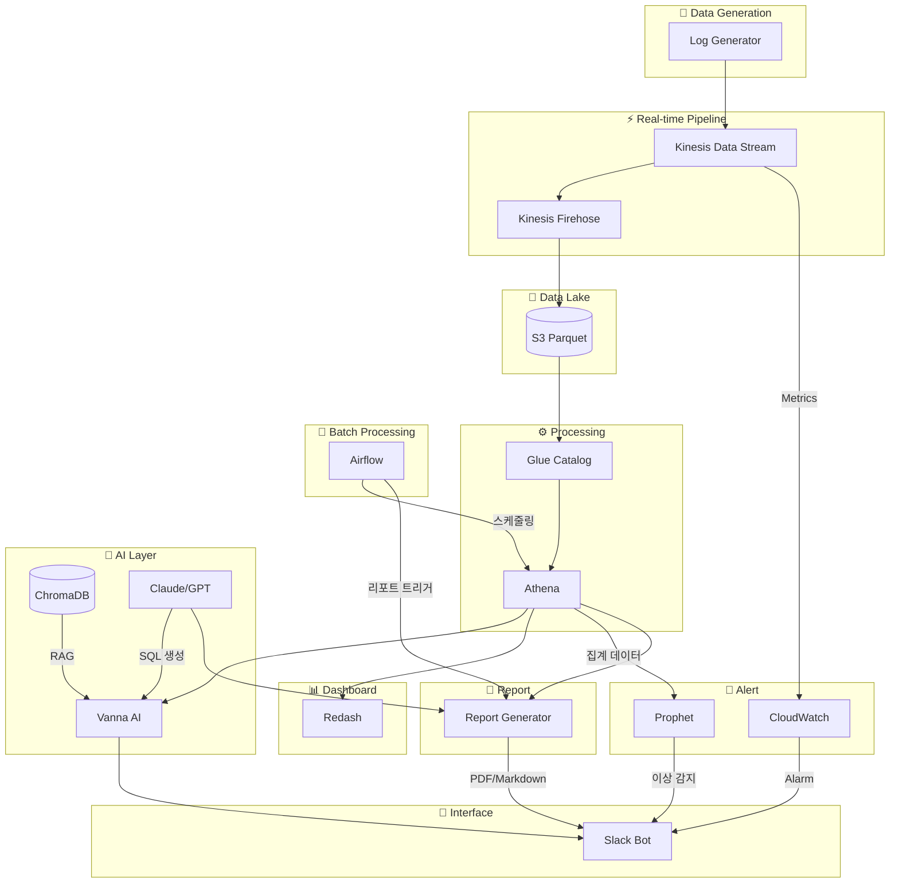

# CAPA 프로젝트 컨셉 v4

> **버전**: v4 (압축 버전)  
> **최종 수정**: 2026-02-11  
> **별도 문서**: [PR 스토리라인](./presentation_pitch.md) | [기술 상세](./technical_details.md) | [확장 로드맵](./future_roadmap.md)

---

## 프로젝트 정의

**CAPA (Cloud-native AI Pipeline for Ad-logs)**

> 온라인 광고 로그 파이프라인 구축 및 **AI 기반 분석 플랫폼** 설계

광고 비즈니스의 비개발자가 자연어로 데이터를 조회하고,  
AI가 이상을 먼저 알려주며, 리포트를 자동으로 생성합니다.

### 핵심 메시지

> **AI 분석 플랫폼은 분석 경험을 개선하고, 데이터 파이프라인은 신뢰성을 보장한다.**

### MVP 일정

> 📅 **[MVP 일정 관리 문서](./mvp_schedule.md)** 참조

---

## 타겟 사용자

**광고 비즈니스에서 데이터를 다루는 모든 비개발자**

- AD Ops (광고 운영)
- PM / 기획자
- 세일즈
- 퍼포먼스 마케터

공통점: SQL을 모르지만 데이터를 봐야 하는 사람들

---

## 문제 정의

**근거**: IAB & BWG, "State of Data 2026" 보고서  
**링크**: https://martech.org/75-of-marketers-say-their-measurement-systems-are-falling-short/

> "마케터 4명 중 3명(75%)이 현재 측정 시스템이 필요한 속도, 정확성, 신뢰성을 제공하지 못한다고 응답"

### 핵심 문제점

| 문제 | 현상 |
|------|------|
| 데이터 접근성 부족 | 데이터는 넘쳐나는데, 인사이트는 부족 |
| 분석 도구 진입장벽 | 분석 도구는 있는데, 쓸 줄 아는 사람은 적음 |
| 리포트 생산성 저하 | 리포트는 필요한데, 만드는 데 반나절 소요 |
| 사후 대응 | 문제 발생 후 다음날에야 인지 |

### 보고서 핵심 지적 vs CAPA 해결 방안

| 보고서 지적 | 구체적 문제 | CAPA 해결 방안 | 관련 기능 |
|------------|------------|----------------|----------|
| **속도 부족** | 데이터 조회에 3시간~3일 소요 | Text-to-SQL로 1분 내 조회 | 🗣️ Ask, 📝 Report |
| **정확성 부족** | SQL 실수, 수동 집계 오류 | AI가 SQL 생성하여 휴먼 에러 제거 | 🗣️ Ask |
| **신뢰성 부족** | 이상 징후 늦게 발견 | 실시간 이상 탐지 알림 | 🔔 Alert, 📝 Report |

---

## 문제 심층 분석: 병목은 어디에 있는가?

기술적으로는 이미 다음과 같은 환경이 갖춰져 있습니다:

✅ 대규모 실시간 로그 수집 인프라  
✅ 안정적인 로그 저장 및 적재 구조  
✅ SQL 기반 데이터 분석 환경  

그러나 실제 업무 현장에서는:

> "CTR이 왜 떨어졌는지 알고 싶다"  
> "어제 캠페인별 성과를 한 번에 보고 싶다"

분석 요청은 자연어로 들어오지만, 이를 결과로 전환하기까지:

```
[현재 분석 요청 → 결과 프로세스]

1. 데이터 구조 및 도메인 맥락 파악 (데이터팀)
2. 적절한 테이블 및 컬럼 선택 (데이터팀)
3. SQL 작성 및 실행 (데이터팀)
4. 결과 시각화 및 해석 (데이터팀 → 요청자)
5. 추가 요청 → 1~4 반복
```

### 핵심 인사이트

> **병목은 분석 자체가 아니라, 분석 요청과 결과를 주고받는 과정에 있습니다.**

| 단계 | 소요 시간 | 문제점 |
|------|----------|--------|
| 요청 → 접수 | 수 시간 | 데이터팀 백로그 대기 |
| 요청 해석 | 30분 | 의도 파악 |
| SQL 작성 | 30분~2시간 | 복잡도 상이 |
| 결과 전달 | 10분 | 컨텍스트 스위칭 |
| 추가 요청 | 전체 반복 | "조금만 바꿔서 다시" |

**총 소요 시간: 3시간 ~ 3일** (요청 1건당)

---

## 해결 방향: AI 기반 분석 플랫폼

CAPA는 기존 SQL 기반 데이터 분석 환경 위에 **AI 기반 분석 플랫폼**을 결합합니다.

### 핵심 아이디어

**핵심**: 자연어 질문 → AI가 SQL 생성 → 즉시 결과

```
[CAPA 분석 프로세스]

1. 사용자가 자연어로 질문
   "@capa-bot 어제 캠페인별 CTR top 5 알려줘"
         ↓
2. AI가 즉시 SQL 생성 및 실행
         ↓
3. 결과 + 생성된 SQL 함께 제공 (투명성)
```

> 💡 **Note**: CAPA는 세션/맥락 관리를 하지 않습니다.  
> 매번 새로운 질문으로 처리되며, 필요한 맥락은 질문에 모두 포함해야 합니다.

### AI 분석 플랫폼의 핵심 원칙

#### 1. 자연어 → 분석 결과까지 자동 연결

| Before | After |
|--------|-------|
| 요청자 → 티켓 → 데이터팀 → SQL → 결과 | 요청자 → CAPA AI → SQL → 결과 |
| 3시간 ~ 3일 | 1분 |

#### 2. 분석 과정의 투명성 확보

- ✅ 생성된 SQL 쿼리 함께 제공
- ✅ 사용 지표 및 집계 기준 명시
- ✅ 결과 검증 가능 구조 유지

---

## 솔루션: CAPA 핵심 기능

### 4가지 핵심 기능

| 기능 | 설명 | 해결하는 문제 |
|------|------|--------------| 
| 🗣️ **Ask** | 슬랙에서 자연어로 질문 → AI가 SQL로 답변 | 분석 도구 진입장벽, 데이터 접근성 |
| 📝 **Report** | 주간/월간 리포트 자동 생성 | 리포트 생산성 |
| 🔔 **Alert** | 이상 탐지 + 즉시 알림 | 사후 대응 → 선제 대응 |
| 📊 **Dashboard** | KPI 대시보드 (Redash) | SQL 없이 시각화 확인 |

---

## Before / After

| 항목 | Before | After |
|------|--------|-------|
| 데이터 조회 | 데이터팀 요청 → 3시간~3일 대기 | @capa-bot 멘션 → 1분 내 답변 |
| 주간 리포트 | 데이터 수집 + 정리 + 작성 = 4시간 | "리포트 만들어줘" → 1분 내 생성 |
| 이상 감지 | 다음날 리포트에서 뒤늦게 인지 | AI가 이상 패턴 감지 → 즉시 알림 |
| KPI 확인 | SQL 몰라서 데이터팀 요청 | Redash 대시보드에서 직접 확인 |

---

## 기술 스택

### Data Pipeline
- Kinesis Data Stream → Firehose → S3 (Parquet) → Glue → Athena

### AI/ML (확장 단계에서 구현)
- Text-to-SQL: Vanna AI + ChromaDB + OpenAI API (GPT-4)
- Report: Claude/GPT API (요약, 인사이트 생성)
- Alert: CloudWatch (MVP) / Prophet 시계열 예측 (확장)

> ⚠️ **MVP에서는 LLM 호출 없이 파이프라인 연결만 확인**, AI 기능은 확장 단계에서 구현

### Infrastructure
- Terraform + EKS + Airflow

### Interface
- Slack Bolt + FastAPI + Redash

---

## 아키텍처 개요



### 아키텍처 컴포넌트 설명

| 컴포넌트 | 역할 | 관련 기능 |
|----------|------|-----------|
| **Kinesis Data Stream** | 실시간 로그 수집 | 전체 |
| **Kinesis Firehose** | S3로 Parquet 변환 저장 | 전체 |
| **S3** | 데이터 레이크 | 전체 |
| **Glue Catalog** | 메타데이터 관리 | Ask, Report, Dashboard |
| **Athena** | SQL 쿼리 엔진 | Ask, Report, Dashboard |
| **Airflow** | 배치 작업 스케줄링 | Report |
| **Vanna AI** | Text-to-SQL 프레임워크 | Ask |
| **ChromaDB** | 벡터 DB (RAG) | Ask |
| **Claude/GPT** | LLM | Ask, Report |
| **CloudWatch** | 메트릭 + 알람 (MVP) | Alert |
| **Prophet** | 시계열 예측 (확장) | Alert |
| **Slack Bot** | 대화형 인터페이스 | Ask, Alert, Report |
| **Redash** | KPI 대시보드 | Dashboard |

---

## 기대 효과

| 지표 | Before | After | 개선 |
|------|--------|-------|------|
| 데이터 조회 시간 | 3시간~3일 | 수 분 내 | 대폭 단축 |
| 리포트 작성 시간 | 반나절 | 수 분 내 | 대폭 단축 |
| 이상 감지 시간 | D+1 | 자동 탐지 | 선제 대응 |
| KPI 확인 방식 | SQL 작성 필요 | 대시보드 직접 확인 | 접근성 향상 |

---

## 기능 상세

### 1. 🗣️ Ask - Text-to-SQL (핵심 기능)

| 항목 | 내용 |
|------|------|
| 문제 | SQL을 모르면 데이터 조회 불가 |
| 해결 | 자연어 질문 → AI가 SQL 생성 → 결과 반환 |
| 예시 | "어제 캠페인별 CTR top 5 알려줘" |
| 기술 | Vanna AI + ChromaDB + Athena |

#### MVP vs 확장

| 구분 | MVP | 확장 |
|------|-----|------|
| 응답 | echo (하드코딩) | AI가 SQL 생성 + 실행 |
| LLM 호출 | ❌ | ✅ |
| 목적 | 파이프라인 연결 확인 | 실제 분석 기능 |

#### Vanna AI 개요

**RAG 기반 Text-to-SQL 프레임워크**

1. **학습**: DDL, 예시 SQL, 도메인 문서를 ChromaDB에 저장
2. **질의**: 자연어 질문 → 유사 컨텍스트 검색 (RAG) → LLM이 SQL 생성

> 📖 상세 내용: [기술 상세 문서](./technical_details.md#1-vanna-ai-구현-상세)

---

###  2. 🔔 Alert - 이상 탐지 알림

| 항목 | 내용 |
|------|------|
| 문제 | CTR 급락, 트래픽 이상을 뒤늦게 인지 |
| 해결 | 비즈니스 지표 이상 감지 시 즉시 알림 |
| 예시 | "🚨 CTR이 예측값 대비 급락. 캠페인 확인 필요" |
| 기술 | CloudWatch + Prophet → SNS → Slack |

#### MVP vs 확장

| 단계 | 방식 | 기술 | 탐지 대상 |
|:----:|------|------|----------|
| **MVP** | CloudWatch 기반 | CloudWatch Metrics + Alarm | 로그 유입량, 기본 임계값 |
| **확장** | 시계열 예측 | Prophet / ARIMA | CTR, CVR, RPM (계절성 반영) |

#### 왜 시계열 예측이 필요한가?

단순 임계값 기반(CloudWatch)은 "월요일 오전이라 트래픽이 적은지" vs "진짜 이상인지" 구분이 어렵습니다.

**Prophet으로 해결**:
- 과거 데이터로 "기대값" 예측
- 실제 값과 비교하여 신뢰구간 벗어나면 알림

> 📖 상세 내용: [기술 상세 문서](./technical_details.md#3-prophet-시계열-예측)

---

### 3. 📝 Report - 자동 리포트 생성

| 항목 | 내용 |
|------|------|
| 문제 | 매주 리포트 작성에 반나절 소요 |
| 해결 | AI가 주간/월간 성과 리포트 자동 작성 |
| 예시 | "이번 주 캠페인 성과 리포트 만들어줘" → PDF/Markdown 생성 |
| 기술 | LLM + Jinja 템플릿 + Athena 데이터 |

#### 구성 요소

1. **Airflow DAG**: 스케줄링 (매주 월요일 9시)
2. **Athena Client**: 데이터 조회 (SQL 실행)
3. **LLM API**: 요약/인사이트 생성
4. **Jinja2 Template**: 리포트 포맷
5. **Slack Client**: 결과 전송

> 📖 상세 내용: [기술 상세 문서](./technical_details.md#2-report-generator-구현)

---

### 4. 📊 Dashboard - KPI 대시보드

**Redash** 기반 KPI 대시보드로 SQL 없이 시각화 확인

---

## MVP vs 확장 구분

### MVP (10일): 파이프라인 연결 확인
- 🗣️ Ask: Slack echo bot (LLM X)
- 📝 Report: Athena 집계 결과 Slack 전송 (LLM X)
- 🔔 Alert: CloudWatch 기본 임계값
- 📊 Dashboard: Redash 기본 대시보드

**목적**: AI 없이 전체 파이프라인 연결 검증 → 리스크 최소화

### 확장 (4주): AI 기능 구현
- 🗣️ Ask: Vanna AI + LLM Text-to-SQL
- 📝 Report: LLM 인사이트 자동 생성
- 🔔 Alert: Prophet 시계열 예측
- 📊 Dashboard: 고급 시각화

---

## 확장 기술 로드맵

| 순위 | 기술 | 난이도 | 임팩트 |
|:----:|------|:------:|:------:|
| 1 | LLM-as-a-Judge | 낮음 | 높음 |
| 2 | RALF Loop | 중간 | 높음 |
| 3 | dbt | 중간 | 높음 |
| 4 | DSPy | 중간 | 중간 |
| 5 | ML 이상 탐지 | 중간 | 중간 |

> 📖 상세 내용: [확장 로드맵](./future_roadmap.md)

---

## 프로젝트 핵심 메시지

### 한 줄 요약

> **AI 분석 플랫폼은 분석 경험을 개선하고, 데이터 파이프라인은 신뢰성을 보장한다.**

CAPA는 신뢰 가능한 데이터 위에서 누구나 빠르게 분석할 수 있는 환경을 만듭니다.

### 문제 → 해결 흐름

```
"데이터는 넘쳐나는데, 인사이트는 부족하다"
                    ↓
"병목은 분석 자체가 아니라, 요청-결과 주고받는 과정"
                    ↓
"CAPA는 이 병목을 제거하는 플랫폼을 만든다"
                    ↓
      [MVP (10일): 파이프라인 연결 + 기본 대시보드]
                    ↓
      [확장: Vanna AI + LLM, Prophet, 리포트 자동화]
```

---

## 참고 자료

- [DableTalk: Text-to-SQL Agent](https://dabletech.oopy.io/2ce5bbc0-e5c2-8089-9dcd-c449b51eba46)
- [Vanna AI Documentation](https://vanna.ai/docs)
- [IAB State of Data 2026](https://martech.org/75-of-marketers-say-their-measurement-systems-are-falling-short/)

---

## 관련 문서

- 📊 [프레젠테이션 스토리라인](./presentation_pitch.md) - PR 및 발표용
- ⚙️ [기술 상세 문서](./technical_details.md) - 코드 예시 및 구현 상세
- 🚀 [확장 로드맵](./future_roadmap.md) - AI 기능 고도화 계획
- 📅 [MVP 일정](./mvp_schedule.md) - 상세 일정 및 작업 계획

---

**문서 버전**: v4.0  
**최종 수정**: 2026-02-11  
**작성자**: CAPA 팀
