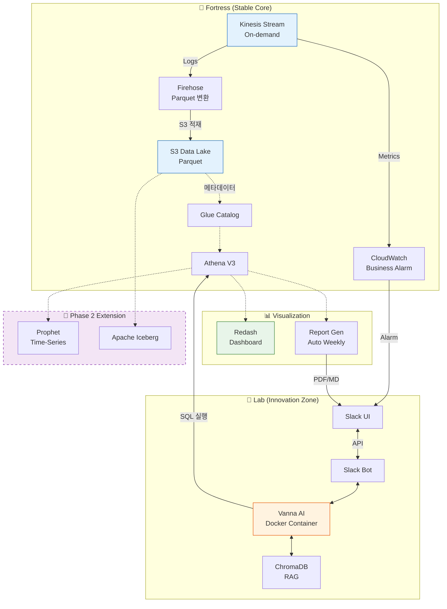

# 📋 CAPA MVP Phase 1 계획서

> 스프린트/기능: MVP Phase 1 - Foundation & Innovation Prototype  
> 작성일: 2026-02-11  
> 버전: v1.3 (컨셉 정합성 검증 완료)

---

## 1. 목표 정의

### 1.1 핵심 목표

```
[CAPA MVP Phase 1: 안정적 데이터 기반 + AI 프로토타입 검증]

- 안정성: 데이터 유실 없는 견고한 파이프라인 구축 (Kinesis → S3 → Athena)
- 혁신성: AI 기반 Text-to-SQL 인터페이스 프로토타입 (Vanna AI)
- 가시성: 비즈니스 KPI 대시보드 및 자동 리포트 (Redash + Report Gen)
```

### 1.2 성공 기준 (Definition of Done)

| 기준 | 측정 방법 | 목표값 |
|------|----------|--------|
| 데이터 유실률 | 파이프라인 로그 전수 검증 | 0% (무결성 100%) |
| AI 답변 정확도 | Human Evaluation (데이터팀 검증) | 80% 이상 |
| 대시보드 구축 | Redash KPI 패널 수 | 5개 이상 핵심 지표 시각화 |
| 자동 리포트 | 주간 리포트 생성 및 Slack 전송 성공률 | 100% |
| 비즈니스 알림 | CloudWatch Alarm 작동 테스트 (로그 급감 시뮬레이션) | 5분 내 알림 수신 |
| DR 복구 시간 | 파이프라인 중단 시나리오 테스트 | 30분 이내 복구 |

### 1.3 범위 (Scope)

**포함 (In Scope) - MVP 필수**:
- [x] Kinesis Data Stream (On-demand) → Firehose → S3 (Parquet) 파이프라인
- [x] Glue Data Catalog 및 Athena V3 설정 (파티셔닝 적용)
- [x] Vanna AI (RAG) 기반 Text-to-SQL 프로토타입 (Docker 격리)
- [x] Redash 대시보드 구축 (주요 KPI 5개 이상)
- [x] 자동 리포트 생성기 (주간 리포트 초안 자동화)
- [x] CloudWatch Business Metrics & Alarm (로그 급감, 지연)
- [x] Disaster Recovery (DR) 시나리오 테스트
- [x] Slack Bot 인터페이스 (Ask 기능 연동)

**제외 (Out of Scope) - Phase 2 확장 (컨셉 반영)**:
- [ ] **Apache Iceberg 실환경 적용**: MVP에서는 S3 Parquet으로 안정성 확보 후, Phase 2에서 Upsert/Snapshot 기능을 위해 도입 (메타데이터 생성 실험만 수행)
- [ ] **Prophet 기반 시계열 이상 탐지**: MVP는 CloudWatch Threshold 기반 알림으로 대응하고, 데이터 축적 후 Phase 2에서 AI 예측 모델 적용
- [ ] **Advanced Report**: MVP는 템플릿 기반 요약, Phase 2에서 LLM 기반 심층 인사이트 생성 구현
- [ ] **프로덕션 배포**: Phase 1은 스테이징 환경까지 구축 및 검증

---

## 2. 배경 및 문제 정의

### 2.1 현재 상황

- **데이터 인프라**: 기존 광고 로그 시스템은 분산되어 있으며, 비개발자의 직접적인 데이터 접근이 불가능함
- **분석 병목**: 데이터팀에 분석 요청 시 평균 3시간~3일 소요 (백로그 대기 + SQL 작성 시간)
- **리포트 생산성**: 주간 성과 리포트 작성에 담당자가 반나절 이상 소요 (수동 집계 및 엑셀 작업)
- **사후 대응**: 트래픽 급감 등 이상 징후를 다음날 리포트를 보고서야 인지 (선제 대응 불가)

### 2.2 해결해야 할 문제

| 문제 | 영향 | 우선순위 |
|------|------|----------|
| **데이터 조회 시간 지연** (3시간~3일) | 의사결정 속도 저하 및 기회 비용 발생 | **높음** |
| **SQL 진입장벽** | 비개발자(마케터, PM)의 데이터 접근 차단 | **높음** |
| **리포트 작성 시간** (반나절) | 고숙련 인력의 생산성 저하 및 단순 반복 업무 피로도 | 중간 |
| **이상 감지 지연** (D+1) | 매출 손실 및 비즈니스 리스크 대응 지연 | 중간 |
| **데이터 파이프라인 신뢰성 미확보** | 잠재적 데이터 유실 리스크 상존 | **높음** |

---

## 3. 기술 스택 및 아키텍처 방향

### 3.1 사용 기술

| 영역 | 기술 | 버전/구성 | 선택 이유 |
|------|------|---------|-----------|
| **데이터 수집** | Kinesis Data Stream | On-demand | 트래픽 예측 불가능성 대응 및 관리 편의성 (보수+진보 통합) |
| **데이터 적재** | Kinesis Firehose | Dynamic Partitioning | Lambda 등 커스텀 로직 최소화로 안정성 확보 (보수) |
| **저장소** | S3 | Parquet | 표준 포맷 사용, Athena 쿼리 성능 최적화 (보수) |
| **메타데이터** | Glue Data Catalog | V3 | 스키마 관리 자동화 및 데이터 카탈로그 중앙화 (중도) |
| **분석 엔진** | Athena | V3 | 서버리스 SQL 엔진으로 운영 부담 최소화 (중도) |
| **시각화** | Redash | Latest | SQL 기반의 빠른 대시보드 구축 및 공유 용이 (중도) |
| **AI - Text-to-SQL** | Vanna AI | 0.x | RAG 기반 오픈소스 프레임워크, 높은 정확도 (진보) |
| **AI - Vector DB** | ChromaDB | Latest | Vanna 학습 데이터(DDL, SQL 예시) 저장 (진보) |
| **AI - LLM** | OpenAI GPT-4 | API | 복잡한 SQL 생성 및 리포트 요약 (진보) |
| **인터페이스** | Slack Bolt | Python | 사내 메신저 통합으로 접근성 극대화 (중도) |
| **IaC** | Terraform | Latest | 인프라 코드화로 재현성 및 버전 관리 확보 (중도) |
| **모니터링** | CloudWatch | - | AWS 네이티브 모니터링 및 알림 (보수) |
| **확장 (Phase 2)** | Prophet, Iceberg | - | 시계열 예측 및 데이터 레이크 고도화 (진보) |

### 3.2 아키텍처 개요

**[Fortress & Lab 구조]**: 안정적 Core + 혁신적 Lab의 이중 트랙 (Two-Track Strategy)



**아키텍처 원칙**:
1.  **Core는 보수적**: Kinesis-S3-Athena 파이프라인은 검증된 AWS 관리형 서비스만 사용하여 무결성을 최우선시합니다.
2.  **AI는 격리**: Vanna AI 및 실험적 기능은 Docker 컨테이너로 격리하여 Core 시스템에 영향을 주지 않도록 합니다.
3.  **Human-in-the-loop**: AI가 생성한 SQL은 즉시 실행되지 않고, 중요 작업의 경우 사용자 승인 절차를 거칩니다.

---

## 4. 작업 분해 (WBS)

### 4.1 작업 목록

| ID | 작업명 | 담당 역할 | 예상 시간 | 의존성 | 우선순위 |
|----|--------|----------|----------|--------|----------|
| **Phase 1: Foundation (안정성)** |
| F-01 | AWS 인프라 구축 (Terraform/CDK) | Infra | 3일 | - | P0 |
| F-02 | Kinesis-S3 파이프라인 구성 및 부하 테스트 | DE | 5일 | F-01 | P0 |
| F-03 | Glue Catalog 및 Athena 최적화 | DE | 3일 | F-02 | P0 |
| F-04 | CloudWatch Business Alarm 설정 | DE | 2일 | F-02 | P1 |
| F-05 | Disaster Recovery (DR) 시나리오 테스트 | All | 2일 | F-03 | P1 |
| **Phase 2: Innovation (AI + Viz)** |
| A-01 | Vanna AI (RAG) 학습 데이터 준비 | AI/DE | 3일 | F-03 | P0 |
| A-02 | Pydantic AI 에이전트 프로토타이핑 | AI | 3일 | A-01 | P1 |
| A-03 | Redash 대시보드 구축 | DE | 3일 | F-03 | P0 |
| A-04 | 자동 리포트 생성기 개발 | BE | 3일 | F-03 | P1 |
| A-05 | Slack Bot 인터페이스 개발 | BE | 3일 | A-01 | P0 |
| A-06 | AI 답변 품질 평가 (Human Evaluation) | All | 2일 | A-05 | P0 |

> **참고**: 각 작업 일정에는 1.5배의 보수적 버퍼가 포함되어 있습니다.

### 4.2 마일스톤

```
┌─────────────────────────────────────────────────────────────────────┐
│ 타임라인 (총 4주 예상)                                               │
├─────────────────────────────────────────────────────────────────────┤
│                                                                     │
│  Week 1        Week 2        Week 3        Week 4                   │
│  ├─────────────┼─────────────┼─────────────┼─────────────┤          │
│  │             │             │             │             │          │
│  ▼ M1: 인프라  ▼ M2: 파이프  ▼ M3: AI Lab  ▼ M4: 통합   │          │
│    구축 완료      라인 검증     프로토타입    테스트 완료 │          │
│              (안정성 확보)  (기능 구현)   (품질 검증)   │
│  F-01~F-03     F-04~F-05     A-01~A-03     A-04~A-06               │
│                                                                     │
└─────────────────────────────────────────────────────────────────────┘
```

---

## 5. 리스크 및 대응 방안

| 리스크 | 영향도 | 발생 확률 | 대응 방안 |
|--------|--------|----------|-----------|
| **데이터 스키마 변경으로 파이프라인 중단** | 높음 | 중간 | Glue Schema Registry 강제 적용 및 하위 호환성 자동 체크 |
| **AI 모델 환각(Hallucination)** | 높음 | 높음 | Human-in-the-loop (승인 후 실행), EXPLAIN 쿼리로 영향도 사전 검증 |
| **클라우드 비용 초과 (Kinesis/Glue)** | 중간 | 중간 | AWS Budget 알람 설정, Kinesis 파티션 키 최적화, Glue Trigger 최적화 |
| **Vanna AI 초기 설정 복잡도** | 중간 | 높음 | Docker 격리 환경 제공, 상세 가이드 문서화 |
| **배포 실패 시 복구 지연** | 높음 | 낮음 | Blue/Green 배포 전략, Terraform State 롤백 스크립트 준비 |
| **Glue Crawler 비용 증가** | 낮음 | 중간 | S3 이벤트 기반 트리거로 전환하여 불필요한 크롤링 방지 |

---

## 6. 리소스 요구사항

### 6.1 인프라
- [x] AWS 계정/권한 (Admin 수준)
- [x] S3 버킷 (Data Lake용)
- [x] Kinesis Data Stream + Firehose
- [x] Athena 워크그룹
- [x] CloudWatch Alarm 설정 권한
- [x] Redash 호스팅 (EC2 또는 Docker)
- [x] Docker 환경 (Vanna AI 격리 실행용)

### 6.2 도구
- [x] Terraform (IaC)
- [x] Python 3.10+ (Vanna, Pydantic AI)
- [x] VS Code + Mermaid Preview Extension
- [x] Slack Workspace (Bot 연동용)

### 6.3 인력
- [x] **Data Engineer (DE)**: 2명 (파이프라인 구축, Athena 최적화, 대시보드)
- [x] **AI/ML Engineer (AI)**: 1명 (Vanna RAG 학습, Pydantic AI 에이전트)
- [x] **Backend Engineer (BE)**: 1명 (Slack Bot, 리포트 생성기)
- [x] **Infra Engineer (Infra)**: 1명 (Terraform, CI/CD)

---

## 7. 검토 및 승인

| 항목 | 검토자 | 상태 | 날짜 |
|------|--------|------|------|
| 기술 검토 | Code Refiner (Validation) | ✅ 승인 (조건부) | 2026-02-11 |
| 범위 확정 | PM | 대기 | |
| 일정 검토 | Tech Lead | 대기 | |
| 최종 승인 | Sponsor | 대기 | |

---

## 변경 이력

| 버전 | 날짜 | 변경 내용 | 작성자 |
|------|------|----------|--------|
| v1.0 | 2026-02-11 | 초안 작성 (3개 페르소나 통합) | AI Planner |
| v1.1 | 2026-02-11 | 검증 피드백 반영 (Report/Dashboard 추가) | AI Planner |
| v1.2 | 2026-02-11 | plan-template.md 구조에 맞춰 전체 재구성 | AI Planner |
| v1.3 | 2026-02-11 | 컨셉 문서 정합성 최종 검증 (Prophet/Iceberg 명기) | AI Planner |
