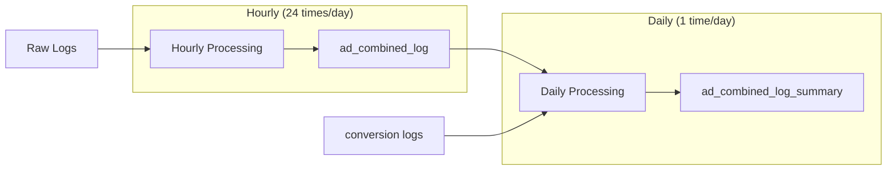

# ETL Summary 생성 프로세스

## 개요
S3에 쌓인 광고 로그 데이터(impression, click, conversion)를 주기적으로 집계하여 summary 테이블을 생성하는 ETL 프로세스입니다. 현재는 테스트 단계이며, 추후 Airflow를 통해 자동화할 예정입니다.

## Summary 테이블 종류

### 1. ad_combined_log (Hourly)
- **생성 주기**: 매시간 (하루 24개)
- **데이터 소스**: impression + click 테이블 조인
- **조인 키**: imp_event_id
- **목적**: 시간별 노출과 클릭을 결합한 상세 로그

### 2. ad_combined_log_summary (Daily)
- **생성 주기**: 매일
- **데이터 소스**: 
  - 24개의 hourly ad_combined_log 테이블
  - 하루 동안의 conversion 로그
- **목적**: 일별 광고 성과 집계 (CTR, CVR 포함)

## S3 폴더 구조

```
s3://your-bucket/
├── raw/                    # 원천 로그 데이터
│   ├── impression/
│   ├── click/
│   └── conversion/
└── summary/               # 집계 데이터
    ├── ad_combined_log/
    │   └── year=2026/
    │       └── month=02/
    │           └── day=24/
    │               ├── hour=00/
    │               ├── hour=01/
    │               └── ...
    └── ad_combined_log_summary/
        └── year=2026/
            └── month=02/
                └── day=24/
```

## 데이터 처리 흐름



## 테이블 스키마

### ad_combined_log (Hourly)
```sql
CREATE EXTERNAL TABLE ad_combined_log (
    imp_event_id STRING,
    user_id STRING,
    campaign_id STRING,
    creative_id STRING,
    device_type STRING,
    timestamp BIGINT,
    is_click BOOLEAN,
    click_timestamp BIGINT
)
PARTITIONED BY (dt STRING)  -- 형식: 2026-02-24-00
STORED AS PARQUET
LOCATION 's3://your-bucket/summary/ad_combined_log/'
TBLPROPERTIES ('compression'='zstd');
```

### ad_combined_log_summary (Daily)
```sql
CREATE EXTERNAL TABLE ad_combined_log_summary (
    campaign_id STRING,
    creative_id STRING,
    device_type STRING,
    impressions BIGINT,
    clicks BIGINT,
    conversions BIGINT,
    ctr DOUBLE,
    cvr DOUBLE
)
PARTITIONED BY (dt STRING)  -- 형식: 2026-02-24
STORED AS PARQUET
LOCATION 's3://your-bucket/summary/ad_combined_log_summary/'
TBLPROPERTIES ('compression'='zstd');
```

## ETL 쿼리 예시

### 1. Hourly: impression + click 조인 (ad_combined_log)
```sql
-- 매시간 실행 (예: 2026-02-24 14시 데이터)
INSERT OVERWRITE TABLE ad_combined_log
PARTITION (dt='2026-02-24-14')
SELECT 
    imp.imp_event_id,
    imp.user_id,
    imp.campaign_id,
    imp.creative_id,
    imp.device_type,
    imp.timestamp,
    CASE WHEN clk.imp_event_id IS NOT NULL THEN true ELSE false END AS is_click,
    clk.timestamp AS click_timestamp
FROM ad_impression imp
LEFT JOIN ad_click clk
    ON imp.imp_event_id = clk.imp_event_id
WHERE imp.dt = '2026-02-24-14'
    AND (clk.dt = '2026-02-24-14' OR clk.dt IS NULL);
```

### 2. Daily: 24시간 ad_combined_log + conversion 집계
```sql
-- 매일 실행 (예: 2026-02-24 전체 데이터)
WITH daily_combined AS (
    SELECT 
        campaign_id,
        creative_id,
        device_type,
        COUNT(DISTINCT imp_event_id) as impressions,
        SUM(CASE WHEN is_click THEN 1 ELSE 0 END) as clicks
    FROM ad_combined_log
    WHERE dt >= '2026-02-24-00' 
        AND dt <= '2026-02-24-23'
    GROUP BY campaign_id, creative_id, device_type
),
daily_conversions AS (
    SELECT 
        campaign_id,
        device_type,
        COUNT(DISTINCT conversion_id) as conversions
    FROM ad_conversion
    WHERE dt = '2026-02-24'
    GROUP BY campaign_id, device_type
)
INSERT OVERWRITE TABLE ad_combined_log_summary
PARTITION (dt='2026-02-24')
SELECT 
    dc.campaign_id,
    dc.creative_id,
    dc.device_type,
    dc.impressions,
    dc.clicks,
    COALESCE(cv.conversions, 0) as conversions,
    CASE 
        WHEN dc.impressions > 0 
        THEN dc.clicks * 100.0 / dc.impressions 
        ELSE 0 
    END as ctr,
    CASE 
        WHEN dc.clicks > 0 
        THEN COALESCE(cv.conversions, 0) * 100.0 / dc.clicks 
        ELSE 0 
    END as cvr
FROM daily_combined dc
LEFT JOIN daily_conversions cv
    ON dc.campaign_id = cv.campaign_id 
    AND dc.device_type = cv.device_type;
```

## 파티션 관리
```sql
-- 파티션 추가
ALTER TABLE ad_combined_log ADD PARTITION (dt='2026-02-24-00');
ALTER TABLE ad_combined_log_summary ADD PARTITION (dt='2026-02-24');

-- 파티션 확인
SHOW PARTITIONS ad_combined_log;
SHOW PARTITIONS ad_combined_log_summary;
```

## 데이터 검증
```sql
-- Hourly 데이터 건수 확인
SELECT dt, COUNT(*) as record_count
FROM ad_combined_log
WHERE dt LIKE '2026-02-24%'
GROUP BY dt
ORDER BY dt;

-- Daily summary CTR 확인
SELECT 
    campaign_id,
    impressions,
    clicks,
    ctr,
    conversions,
    cvr
FROM ad_combined_log_summary
WHERE dt = '2026-02-24'
ORDER BY impressions DESC
LIMIT 10;
```

## 향후 계획

### 1. Airflow DAG 구현
- Hourly DAG: 매시간 ad_combined_log 생성
- Daily DAG: 매일 ad_combined_log_summary 생성

### 2. 추가 Summary 레벨
- **Weekly Summary**: 주간 단위 집계 (7일치 daily summary 재집계)
- **Monthly Summary**: 월간 단위 집계 (30일치 daily summary 재집계)

### 3. 최적화 고려사항
- **증분 처리**: 전체 재처리 대신 변경분만 처리
- **압축 최적화**: Parquet + zstd로 스토리지 비용 절감
- **파티션 프루닝**: 쿼리 시 필요한 파티션만 스캔
- **데이터 보관 정책**: 오래된 raw 데이터 아카이빙

## 모니터링 포인트
1. **데이터 완전성**: impression과 click 매칭률
2. **처리 지연**: ETL 완료 시간
3. **데이터 품질**: CTR/CVR 이상치 탐지
4. **스토리지 사용량**: 파티션별 데이터 크기

## 참고사항
- 모든 시간은 UTC 기준
- 파티셔닝 키 형식: 
  - Hourly: `dt=YYYY-MM-DD-HH`
  - Daily: `dt=YYYY-MM-DD`
- Conversion 데이터는 노출/클릭 대비 늦게 발생할 수 있으므로 재처리 고려