# AWS Console Setup Worklog (2026-02-11)

이 문서는 AWS 콘솔에서 수동으로 진행한 인프라 구축 과정을 기록합니다.
(아래 스크린샷 갤러리에 있는 이미지를 각 단계에 맞춰 배치하여 정리해주세요.)

## 1. AWS Kinesis Data Stream 연결 (수집)

**작업 내용:**
- **서비스**: Kinesis Data Streams
- **리소스명**: `capa-ad-logs-dev`
- **설정**:
    - 리전: `ap-northeast-2` (서울)
    - 용량 모드: `On-demand` (온디맨드)
- **역할**: Python 로그 생성기에서 보내는 실시간 로그 데이터를 수신하는 버퍼 역할.

---

## 2. AWS Kinesis Firehose 연결 (적재)

**작업 내용:**
- **서비스**: Amazon Kinesis Data Firehose
- **리소스명**: `capa-firehose-dev`
- **설정**:
    - **Source**: Kinesis Data Stream (`capa-ad-logs-dev`)
    - **Destination**: Amazon S3 (`capa-logs-dev-ap-northeast-2`)
    - **Buffer Settings**: 128MB 또는 300초
- **역할**: Kinesis Stream의 데이터를 가져와서 Glue 스키마에 따라 변환 후 S3에 저장.

---

## 3. AWS Glue 연동 (스키마 정의)

**작업 내용:**
- **서비스**: AWS Glue Data Catalog
- **리소스명**: `capa_db` (Database), `ad_logs` (Table)
- **설정**:
    - **Schema Definition**: JSON 데이터의 컬럼명과 데이터 타입 정의
    - `event_type` (string), `user_id` (string), `bid_price` (double) 등
- **역할**: Firehose가 JSON 데이터를 Parquet로 변환할 때 필요한 데이터 구조(메뉴판) 정보 제공.

---

## 📸 Screenshots Gallery & Context

아래 이미지들을 파일명 순서대로 확인하여 위 섹션에 배치하거나, 이 섹션을 참고해 작업 로그를 완성하세요.

### Group 1: Kinesis Data Stream 생성 (1770771680 ~ 1770771914)
> **기록**: "Kinesis Data Streams 설정: `capa-ad-logs-dev` 스트림 설정 완료 및 작동 확인됨. Python 로거에서 Kinesis 전송 관련 디버그 로그 제거 완료."

- `media__1770771680910.png`
- `media__1770771747946.png`
- `media__1770771782314.png`
- `media__1770771914221.png`

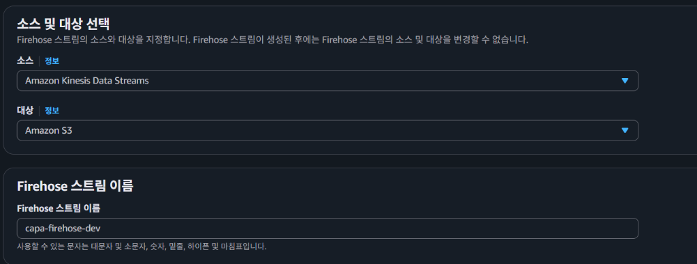
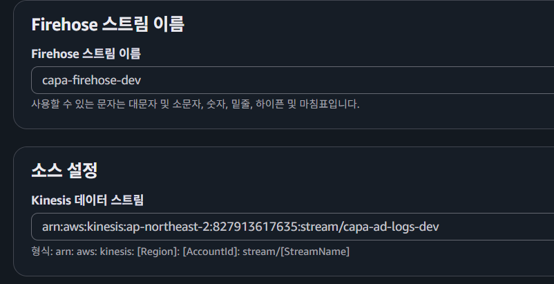
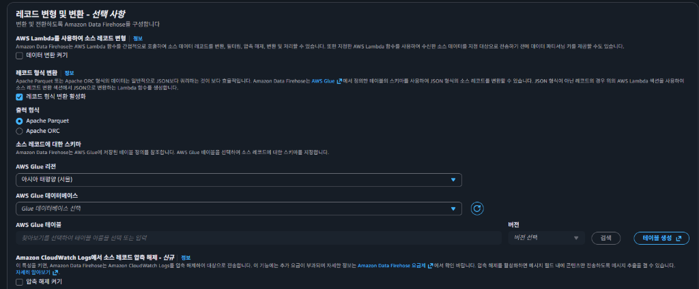
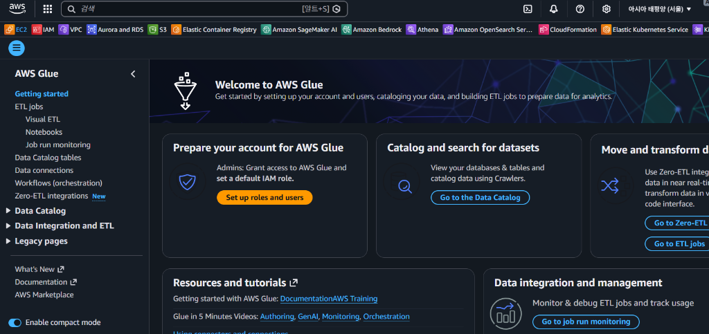

### Group 2: Glue 테이블 및 스키마 설정 (1770772082 ~ 1770772148)
> **기록**: "해결 진행: Glue 테이블 스키마 수동 추가 결정. 에러 데이터만 있는 `errors/` 폴더 기준으로 Crawler를 실행하는 것보다, 직접 스키마를 정의하는 것이 Parquet 변환에 더 적합하다고 판단. `ad_logs` 테이블에 `event_type`, `user_id`, `bid_price` 등의 컬럼 정의."

- `media__1770772082889.png`
- `media__1770772118184.png`
- `media__1770772148757.png`

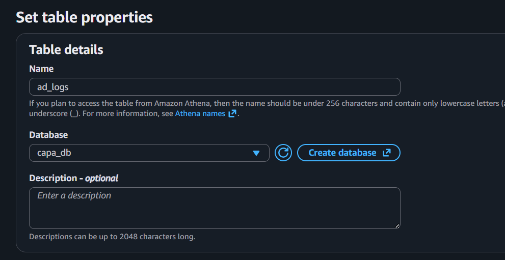
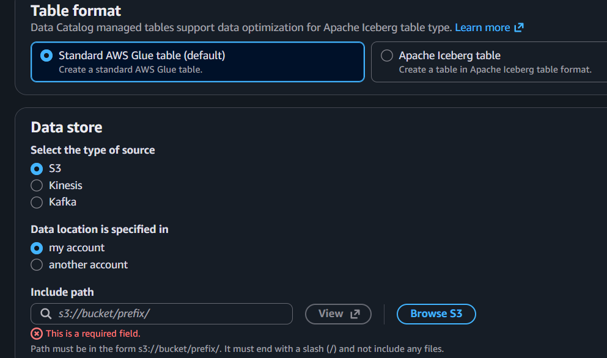
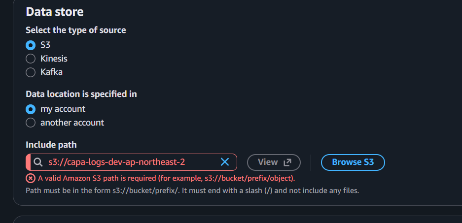

### Group 3: 에러 확인 (1770772187 ~ 1770772218)
> **기록**: "데이터 전송 및 에러 발생: Python 로그 생성기 실행 시, 데이터가 Kinesis Firehose로 전송되었으나 S3 `logs/` 폴더 대신 `errors/` 폴더에만 쌓이는 문제 발생. 에러 원인: Firehose 설정 시 Glue 테이블(`ad_logs`)에 스키마가 정의되지 않아 Parquet 변환 실패. 에러 메시지: `DataFormatConversion.NonExistentColumns` - 'The table does not have columns'"

- `media__1770772187975.png`
- `media__1770772218434.png`

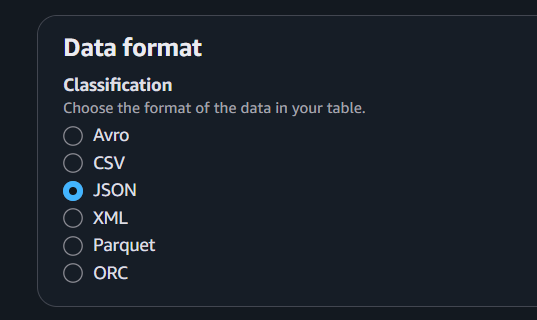
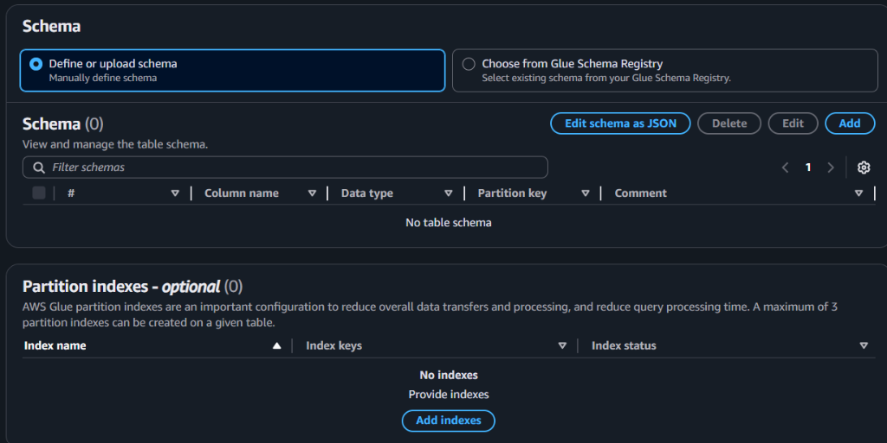

### Group 4: Kinesis Stream 생성 완료 화면 (1770772266 ~ 1770772309)
> **기록**: "Kinesis Data Streams `capa-ad-logs-dev` 상태: `ACTIVE` 확인."

- `media__1770772266836.png`
- `media__1770772309983.png`

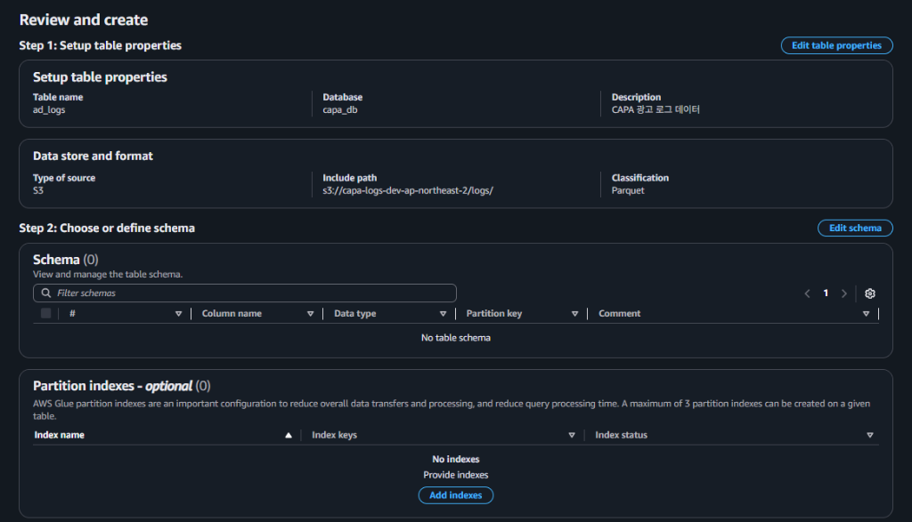
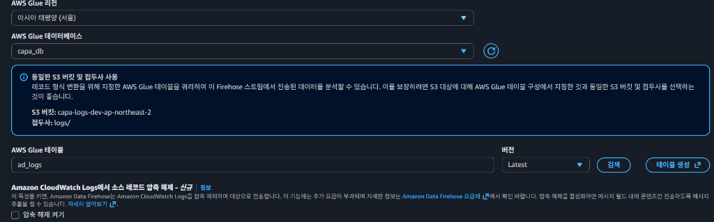

### Group 5: Firehose 스트림 생성 및 설정 (1770772390 ~ 1770774720)
> **기록**: "Kinesis Data Firehose 설정: 스트림 이름 `capa-firehose-dev`, 소스 `Amazon Kinesis Data Streams`, 대상 `Amazon S3`. 데이터 변환 활성화(Parquet), Glue 연동 `capa_db`. S3 버킷 `capa-logs-dev-ap-northeast-2`."

- `media__1770772390443.png` ~ `media__1770774720962.png`

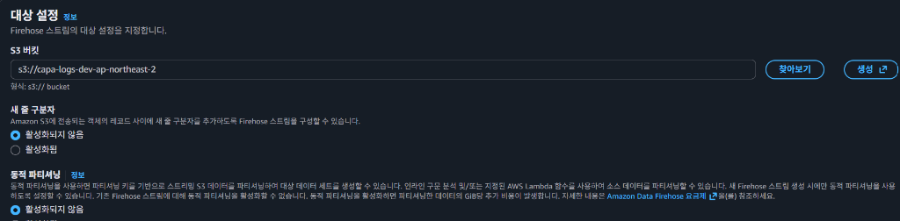
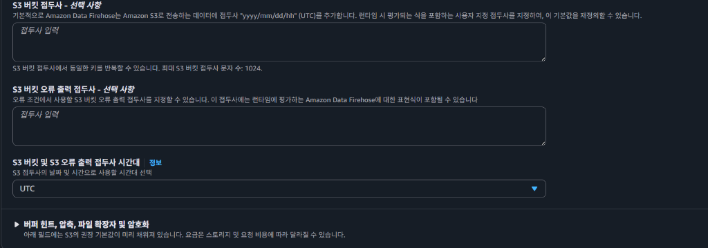
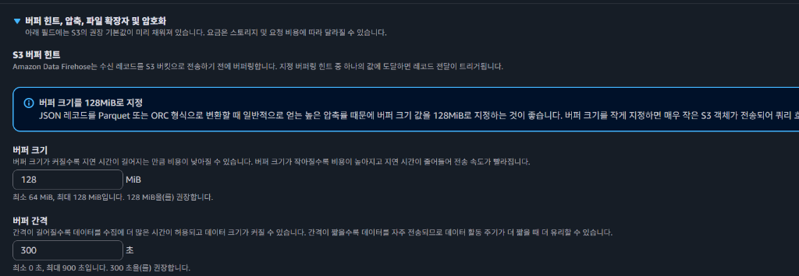
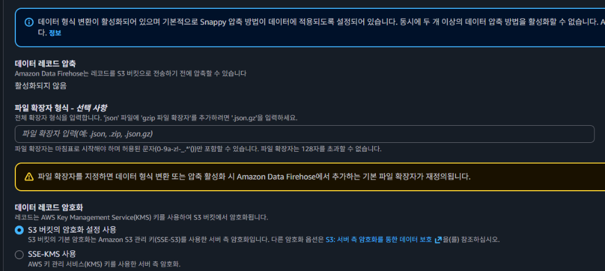
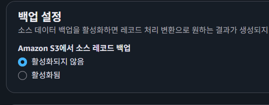
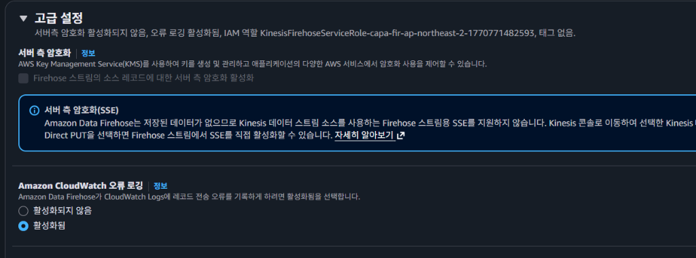
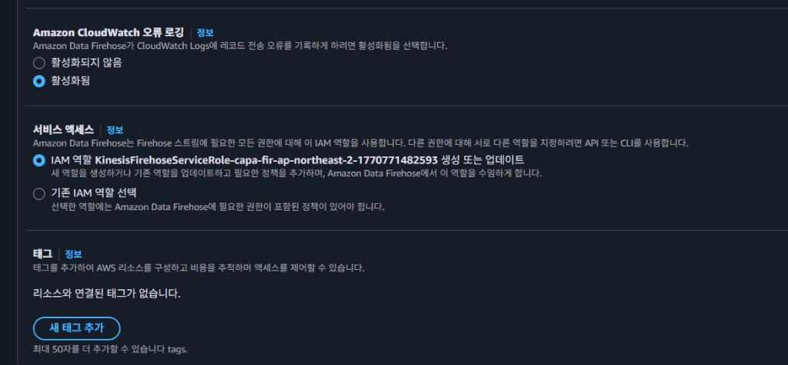
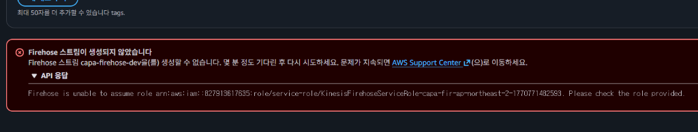
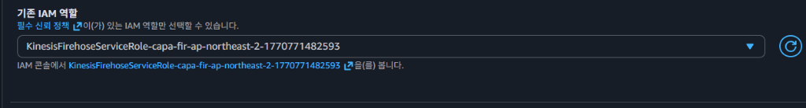
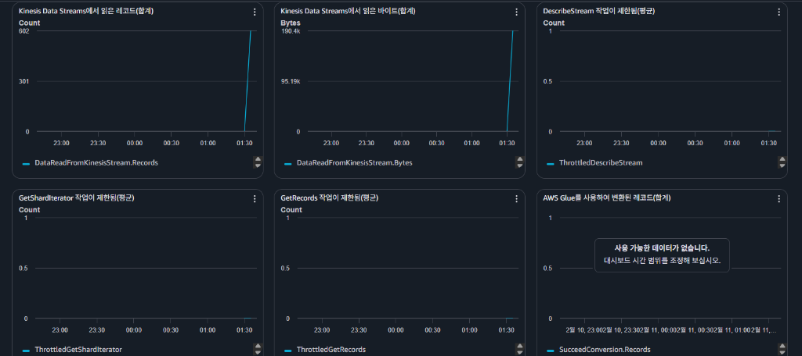
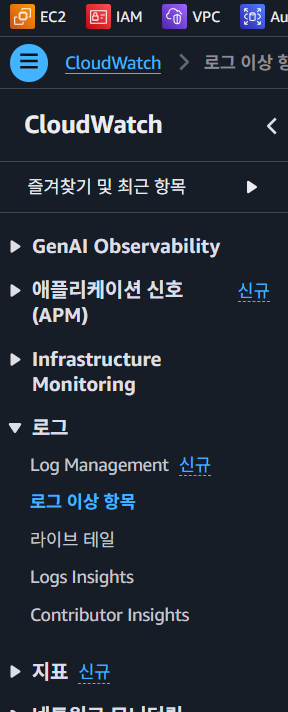
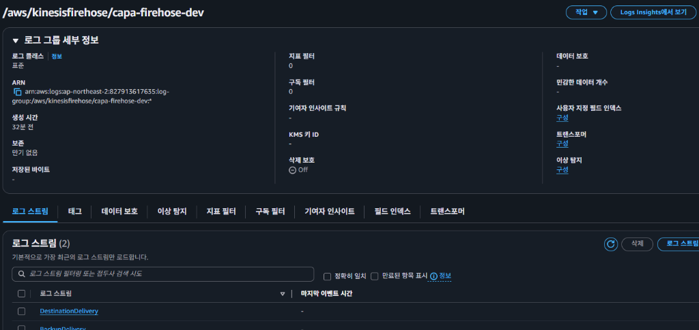
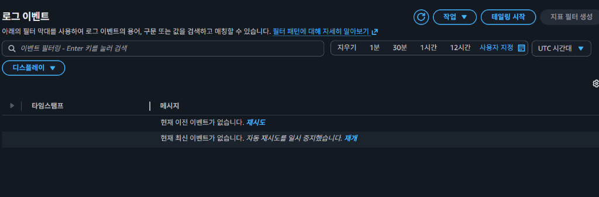
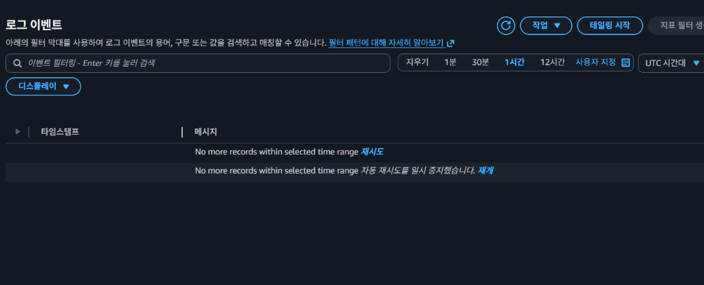

### Group 6: 최종 성공 확인 (1770775190)
> **기록**: "S3 버킷 확인: `s3://capa-logs-dev-ap-northeast-2/logs/` 경로에 Parquet 파일이 정상적으로 생성되는지 확인. 성공."

- `media__1770775190626.png`

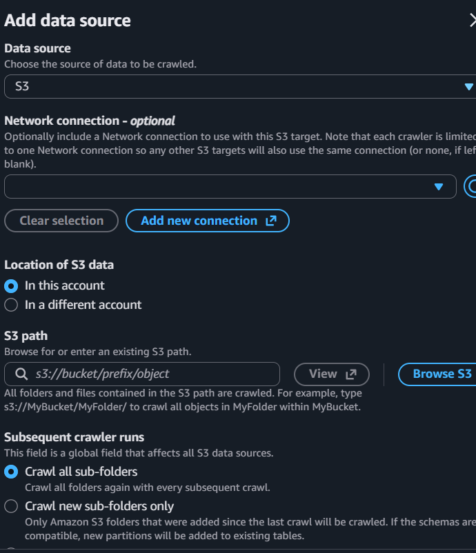
