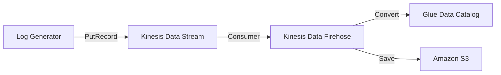

# AWS 인프라 설정 문서

이 문서는 `capa-ad-logs-dev` 데이터 파이프라인을 구축하기 위해 AWS 콘솔에서 수동으로 설정한 내용을 기록합니다.

## 1. Architecture Overview

## 2. Resource Details

### 2.1 Amazon S3
- **Bucket Name**: `capa-logs-dev-ap-northeast-2`
- **Region**: `ap-northeast-2` (Seoul)
- **Folder Structure**:
  - `logs/`: 변환된 Parquet 데이터 저장
  - `errors/`: 변환 실패한 데이터 저장 (JSON)

### 2.2 Kinesis Data Streams
- **Stream Name**: `capa-ad-logs-dev`
- **Capacity Mode**: On-demand
- **Retention Period**: 24 hours

### 2.3 AWS Glue (Data Catalog)
- **Database**: `capa_db`
- **Table**: `ad_logs`
- **Schema**:
  | Column Name | Data Type | Comment |
  |-------------|-----------|---------|
  | event_type | string | impression/click/conversion |
  | event_id | string | Unique event ID |
  | timestamp | string | Event timestamp |
  | user_id | string | User identifier |
  | ad_id | string | Advertisement ID |
  | shop_id | string | Shop identifier |
  | category | string | Shop category |
  | bid_price | double | Bid price for impression |
  | impression_id | string | Related impression ID |
  | cpc_cost | double | Cost per click |
  | click_id | string | Related click ID |
  | action_type | string | Conversion action type |
  | total_amount | double | Total purchase amount |

### 2.4 Kinesis Data Firehose
- **Delivery Stream Name**: `capa-firehose-dev`
- **Source**: Kinesis Data Stream (`capa-ad-logs-dev`)
- **Destination**: Amazon S3 (`capa-logs-dev-ap-northeast-2`)
- **Data Transformation**: Enabled (Record format conversion)
  - **Input Format**: JSON
  - **Output Format**: Apache Parquet
  - **Schema Configuration**: AWS Glue (`capa_db.ad_logs`)
- **Buffer Hints**: 128 MB or 300 seconds
- **S3 Custom Prefixes**:
  - **Data**: `logs/year=!{timestamp:yyyy}/month=!{timestamp:MM}/day=!{timestamp:dd}/hour=!{timestamp:HH}/`
  - **Error**: `errors/!{firehose:error-output-type}/year=!{timestamp:yyyy}/month=!{timestamp:MM}/day=!{timestamp:dd}/`

## 3. Trouble Shooting

### DataFormatConversion.NonExistentColumns 에러
- **증상**: S3 `errors/` 폴더에 데이터가 쌓이고 `logs/`는 비어있음.
- **원인**: Glue 테이블에 스키마(컬럼) 정보가 없어서 Parquet 변환 실패.
- **해결**: Glue Console에서 `ad_logs` 테이블의 스키마를 수동으로 정의함.

### IAM Permissions
- Firehose 역할(`KinesisFirehoseServiceRole-capa-fir-ap-northeast-2...`)은 다음 권한이 필요:
  - S3 PutObject/GetObject
  - Glue GetTable/GetDatabase
  - Kinesis GetRecords
